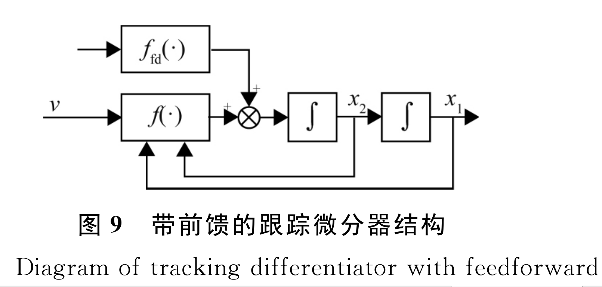

# ADRC-About

## 1.复合微分跟踪器

### 1.1 数学模型

$$
\begin{align}
&\bold{General- modle:}\\
&\begin{cases}

\dot x_1(t) = x_2(t)\\
\dot x_2(t) = R^2[-k_1(x_1(t)-v(t)) - k_2\frac{x_2(t)}{R}]\\
\end{cases}\\

\end{align}
$$


$$
\begin{align}
&\bold{General- Forward Modle:}\\
&\begin{cases}

\dot x_1(t) = x_2(t)\\
\dot x_2(t) = R^2[-k_1(x_1(t)-v(t)) - k_2\frac{x_2(t)}{R}] + \alpha \dot v(t)\\
\end{cases}\\
\end{align}
$$

$$
\begin{align}
&\bold{Discrete- ForwardModle:}\\
&\begin{cases}
T:sample-period\\
x_1(k+1)  = x_2(k)*T + x_1(k) \\
x_2(k+1)= x_2(k) + T[R^2 f(.)] + \alpha [v(k+1) - v(k)]\\
f(.)  = -k_1[x_1(t)-v(t)] - k_2\frac{x_2(t)}{R}\\
\end{cases}
\end{align}
$$
系统跟踪输出与输入信号传递函数：
$$
\begin{align}
& \frac{x_1}{v} = \frac{k_1R^2}{S^2 + k_2RS + k_1R^2}\\
& 系统固有频率:\omega _n = R*\sqrt{k_1},阻尼系数：\xi = \frac{k_2}{2*\sqrt{k_1}}\\

& \frac{x_2}{v} = \frac{R^2k_1S}{S^2 + Rk_2S+k_1R^2}\\
\end{align}
$$

### 1.2 系统框图


				


### 1.3 仿真结果

仿真参数：

```matlab
TDA:2.2,1.3,15,5
TDB:2.2,2.8,150,40

% 2019-12-1
TDA:2.2,1.3,30,15
TDB:2.2,2.8,30,40

```

仿真结果：16.4 rad/s正弦信号，高斯白噪：方差0，协方差：0.04

<H:\MatlabFiles\ADRC\Figures\复合微分跟踪器仿真结果-1总览.fig>

<H:\MatlabFiles\ADRC\Figures\复合微分跟踪器仿真结果-2Track.fig>

### 1.4 代码


```c
/*-----------------------ELDT_R1.h----------------------*/
#pragma once
/*
	微分跟踪器等效线性改进
*/

#define SAMPLE_PERIOD	1000

typedef struct
{
	int k1; 		// 线性等效参数
	int k2;			//
	int R;			
	int Fc;			// 前馈系数

}ELDTParam;

typedef struct
{
	int nTracker;			// 跟踪输出    x1(k+1)
	int nDiff;				// 估计微分输出 x2(k+1)
	int nForwardIn;			// 前馈补偿
	ELDTParam tTdParams;
}tELDT;

// functions
void ELDTrackerInit(tELDT* pSelf_, int nk1_, int nk2_, int nR_,int nFc_);

void ELDTrackerCalc(tELDT* pSelf_, int nTrackSignal_,int nFowardIn_);

void SetELDTrackerParam(tELDT* pSelf_, int nk1_, int nk2_, int nR_,int nFc_);

void TestELDTracker(void);


```


```c
#include "ELDT_R1.h"
#include "stdafx.h"

// 前馈补偿提取
tELDT g_ELDTA;
tELDT* g_pELDTA = &g_ELDTA;


// 主导微分跟踪器
tELDT g_ELDTB;
tELDT* g_pELDTB = &g_ELDTB;

/*
	@Function Description:
	1.初始化微分跟踪器;
	2.设置跟踪器系数;
*/
void ELDTrackerInit(tELDT* pSelf_, int nk1_, int nk2_, int nR_, int nFc_)
{
	pSelf_->tTdParams.k1 = nk1_;
	pSelf_->tTdParams.k2 = nk2_;
	pSelf_->tTdParams.R = nR_;
	pSelf_->tTdParams.Fc = nFc_;

	pSelf_->nDiff = 0;
	pSelf_->nTracker = 0;
	pSelf_->nForwardIn = 0;
	cout << "k1:" << nk1_ << "k2:" << nk2_ << "R:" << nR_ << "Fc:" << nFc_ << endl;
}


void ELDTrackerCalc(tELDT* pSelf_, int nTrackSignal_, int nFowardIn_)
{
	// 局部变量非规范命名，方便分析原始公式
	int k1 = pSelf_->tTdParams.k1;
	int k2 = pSelf_->tTdParams.k2;
	int R = pSelf_->tTdParams.R;
	int a = pSelf_->tTdParams.Fc;

	int err_1 = pSelf_->nTracker - nTrackSignal_;

	pSelf_->nTracker = pSelf_->nTracker + pSelf_->nDiff / SAMPLE_PERIOD;
	pSelf_->nDiff = pSelf_->nDiff + (-k1 * err_1*R*R - k2 * pSelf_->nDiff*R) / SAMPLE_PERIOD
		+ a * (nFowardIn_ - pSelf_->nForwardIn);
	pSelf_->nForwardIn = nFowardIn_;
}

/*
	修改外部参数
*/
void SetELDTrackerParam(tELDT* pSelf_, int nk1_, int nk2_, int nR_, int nFc_)
{
	pSelf_->tTdParams.k1 = (pSelf_->tTdParams.k1 != nk1_ ? nk1_ : pSelf_->tTdParams.k1);
	pSelf_->tTdParams.k2 = (pSelf_->tTdParams.k2 != nk2_ ? nk2_ : pSelf_->tTdParams.k2);
	pSelf_->tTdParams.R = (pSelf_->tTdParams.R != nR_ ? nR_ : pSelf_->tTdParams.R);
	pSelf_->tTdParams.Fc = (pSelf_->tTdParams.Fc != nFc_ ? nFc_ : pSelf_->tTdParams.Fc);
}

/*
	Simulator
*/
void TestELDTracker()
{
	ELDTrackerInit(g_pELDTA, 2, 1, 15, 5);
	ELDTrackerInit(g_pELDTB, 2, 3, 150, 40);
	ifstream indata;
	ofstream outdata;
	// 绝对路径
#if TRUE
	string _sInPath("C:\\Users\\Whtest\\Desktop\\temp.txt");
	string _sOutPath("C:\\Users\\Whtest\\Desktop\\ELDT.txt");
#else
	// 相对路径
	string _sInPath("..//..//temp.txt");
	string _sOutPath("..//..//ELDT.txt");
#endif
	
	indata.open(_sInPath, ios::in);
	outdata.open(_sOutPath, ios::out);
	if (indata.is_open())
	{
		string strOne;
		int _nOptCnt = 0;
		while (getline(indata, strOne))
		{
			/*
				获取原始信号
			*/
			stringstream ss;
			ss << strOne;
			int a = 0; char b = ' '; int c = 0;
			ss >> a >> b >> c;
			//cout << a << "  " << c << endl;

			// 数据处理
			ELDTrackerCalc(g_pELDTA, c, c);
			ELDTrackerCalc(g_pELDTB, c, g_pELDTA->nTracker);
			_nOptCnt++;
			cout << _nOptCnt << "," << g_pELDTA->nTracker
				<< "," << g_pELDTA->nDiff << "," << g_pELDTB->nTracker << "," << g_pELDTB->nDiff << endl;
			outdata << _nOptCnt << "," << c << "," << g_pELDTA->nTracker << "," << g_pELDTA->nDiff;
			outdata << "," << g_pELDTB->nTracker << "," << g_pELDTB->nDiff << endl;
		}
	}
	indata.close();
	if (outdata.is_open())
	{
		outdata.close();
	}
	system("start matlab-operator.bat ");
}

```


## 2.ESO（Extented State Observer）

### 2.1 数学模型

**SISO n-dimensional nonlinear system:**
$$
\begin{align}
& \begin{cases} 
x^{(n)}(t) = f(t,x(t),\dot x(t), \ddot x(t),...x^{(n-1)}(t)) + \omega(t) + u(t)\\
y(t) = x(t)\\
\end{cases}
\end{align}
$$


**n-dimensional nonlinear system With Initial State:**
$$
\begin{align}
&\begin{cases}
\dot x_1(t) = x_2(t),x_1(0)=x_{10}\\
\dot x_2(t) = x_3(t),x_2(0)=x_{20}\\
.\\.\\.\\
\dot x_n(t) = f(t,x_1(t),...x_{n}(t)) + \omega(t) + u(t),x_{n0}(0) = x_{n0} \\
y(t) = x_1(t)
\end{cases}
\end{align}
$$


**Continuous ESO Model:**
$$
\begin{align}
&\begin{cases}
\varepsilon_1 = z_1(t) - y(t)\\
\dot z_1(t) = z_2(t) - \beta_{01}\varepsilon_1\\
\dot z_2(t) = z_3(t) - \beta_{02}fal(\varepsilon_1,\alpha_{01},\delta) + b_0u\\
\dot z_3(t) = -\beta_{03}fal(\varepsilon_1,\alpha_{02},\delta)\\
\end{cases}\\

\end{align}
$$


**Fal:**
$$
\begin{align}
&fal(\varepsilon,\alpha,\delta)=\begin{cases}
|\varepsilon|^2sgn(\varepsilon),|\varepsilon| > \delta,\\
\varepsilon /\delta^{1-\alpha} 
\end{cases}\delta >0\\
\end{align}
$$


**Discrete ESO Model:**
$$
\begin{align}
&T:系统采样周期，如果将其换成h,可以进行变步长操作;\\
&\begin{cases}
\varepsilon_1(k) = z_1(k) - y(k)\\
z_1(k) = z_1(k-1) + T(f_{first}(.))\\
z_2(k) = z_2(k-1) + T(f_{second}(.))\\
z_3(k) = z_3(k-1) + T(f_{third}(.))\\
\end{cases}
\end{align}
$$


**Continuous LSEO Model:**
$$
\begin{align}
&\begin{cases}
\varepsilon_1 = x_1(t) - y\\
\dot x_1(t) = x_2(t) - \beta_1 \varepsilon_1\\
\dot x_2(t) = x_3(t) - \beta_2 \varepsilon_1 + b_0u\\
\dot x_3(t) = -\beta_3 \varepsilon_1\\
&\end{cases}\\
&u = \frac{-x_3(t)+u_0}{b_0}
\end{align}
$$


**Discrete LSEO Model:**
$$
\begin{align}
&\begin{cases}
h:sample \space period \\
\varepsilon_1 = x_1(k) -y(k)\\
x_1(k+1) = x_1(k) + (x_2(t)-\beta_1\varepsilon_1)h\\
x_2(k+1) = x_2(k) + (x_3(k)-\beta_2 \varepsilon_1+ b_0u(k))h \\
x_3(k+1) = x_3(k) - \beta_3\varepsilon_1\\
\end{cases}
\end{align}
$$


### 2.3 NLSEF(Nonlinear State Error Feedback)

**Discrete Model:**
$$
\begin{align}

&\begin{cases}
e_p(k) = v_1(k) - z_1(k),e_D(k) = v_2(k) - z_2(k),\\
u_0(k) = K_pfal(e_p,\alpha_p,\delta_p) + K_dfal(e_D,\alpha_D,\delta_D),\\
u(k) = u_0(k) - z_3(k)/b_0.
\end{cases}
\end{align}
$$

### 2.4 LADRCU

**Second Order Control Out:**
$$
\begin{align}
&u(k) = \frac{u_0 - \widehat x_{n+1}}{b_0}\\
& u_0 = kp*(track - \widehat x_1) + kd*(diff - \widehat x_2)\\
& b_0:补偿因子\\
\end{align}
$$

```matlab
u(k) = （u0(k) - xn+1(k)）/b0
u0(k) = kp*(track(k) - x1(k)) + kd*(diff(k) - x2(k))
```


### 2.5 离散方式

**显示欧拉（前向差分）:**
$$
\begin{align}
&\Rightarrow\dot x_1(t) = x_2(t)\\
& \Rightarrow \frac{x_1(k+1) - x_1(k)}{h} = x_2(k)\\
&\Rightarrow x_1(k+1) = h*x_2(k) + x_1(k)\\

\end{align}
$$
**隐式欧拉（后向差分):**
$$
\begin{align}
&\Rightarrow\dot x_1(t) = x_2(t)\\
& \Rightarrow \frac{x_1(k) - x_1(k-1)}{h} = x_2(k)\\
&\Rightarrow x_1(k) = h*x_2(k-1) + x_1(k)\\

\end{align}
$$


### 2.5 调试参数

```
调试结果:
1.被控对象：典型二阶被控对象[3]  
2.调试参数：
ESO:b0 = 150,ω0 = 8,Kp = 280,kd = 2;
TD:α = 1e-2,δ = 5e6;

ESO:b0 = 1000 ω0 = 5,25,75,100


```

function GetLADRCParam(w0)

```matlab
function GetLADRCParam(w0)
%{
    β1 = 3*ω0，β2 = 3*ω0^2 β3 = ω0^3,ω0是观测器带宽，
%}
    beta_1 = w0*w0;
    beta_2 = 3*beta_1;  
    beta_3 = w0*beta_1;
    fprintf('bandwidth of eso is %d rad/s,beta_1:%d,beta_2:%d,beta_3:%d\nParams:%d,%d,%d\n'...
        ,w0,beta_1,beta_2,beta_3,beta_1,beta_2,beta_3);
end
```


### 2.6 Code

**LESO.m**

```matlab
%{
    函数说明：
    1.扩张状态观测器将系统视为串联积分形,一阶状态，二阶状态是系统的速度，加速度;
    2.二阶扩张观测器
    3.观测器参数，β1，β2，β3关系:
    β1 = 3*ω0，β2 = 3*ω0^2 β3 = ω0^3,ω0是观测器带宽，
    @Funcname:扩张观测器
    @param:beta1,观测器系数
    @param:beta3,观测器系数
    @param:beta2,观测器系数

    调试结果:
    1.被控对象：典型二阶被控对象[3]  
    2.调试参数：
    ESO:b0 = 150,ω0 = 8,Kp = 280,kd = 2;
    TD:α = 1e-2,δ = 5e6;
    
    
    reference:
    [1] 线性ADRC参数整定 https://blog.csdn.net/handsome_for_kill/article/details/88398467
    [2] 纪恩庆, 肖维荣. 二阶自抗扰控制器的参数简化[J]. 自动化仪表, 2007, 28(5).
    [3] H:\MatlabFiles\ADRC\Scripts\SystemModel_R1.m


%}
function [sys,x0,str,ts] = LADRC_ESO(t,x,u,flag,beta1,beta2,beta3)

switch flag,
    
    case 0,
        [sys,x0,str,ts] = mdlInitializeSizes;
        
    case 2,
        sys = mdlUpdate(t,x,u,beta1,beta2,beta3); 
        
    case 3,
        sys = mdlOutputs(t,x,u);
        
    case {1,4,9},
        sys = [];
        
    otherwise
        DAStudio.error('Simulink:blocks:unhandledFlag', num2str(flag));
        
end

% ==========================================================================

function [sys,x0,str,ts] = mdlInitializeSizes

sizes = simsizes;
sizes.NumContStates  = 0;
sizes.NumDiscStates  = 3;
sizes.NumOutputs     = 3;
% u(1) = y(k),u(2) = ctrl_u
sizes.NumInputs      = 2;
sizes.DirFeedthrough = 1;
sizes.NumSampleTimes = 1;
sys = simsizes(sizes);
x0  = [0,0,0];
str = [];
ts  = [1e-3 0];
% end mdlInitializeSizes


% ==========================================================================
%{
    过程向量:x = [z1(k),z2(k),z3(k)];
    输入向量:u = [y(k),u(k)];
    输入向量:x = [z1(k+1),z2(k+1),z3(k+1)];
%}
function sys = mdlUpdate(t,x,u,beta1,beta2,beta3)
T = 1e-2;
h = T;
e = x(1) - u(2);
% z = [z1(k),z2(k),z3(k)];
z = zeros(1,3);
Continuous_Sys = false;
if Continuous_Sys
    % 连续形式
    z1 = x(2) - beta1*e;
    z2 = x(3) - beta2*e + u(2);
    z3 = -beta3*e;
    x = [z1,z2,z3];
else
    z(1) = x(1) + h*(x(2) - beta1*e);
    z(2) = x(2) + h*(x(3) - beta2*e + u(1));
    z(3) = x(3) - h*beta3*e;
end
x(1) = z(1);
x(2) = z(2);
x(3) = z(3);

sys(1) = x(1);
sys(2) = x(2);
sys(3) = x(3);

%============================================================================
function sys = mdlOutputs(t,x,u)
sys(1) = x(1);
sys(2) = x(2);
sys(3) = x(3);
```

## 3.离散卷积

### 3.1

递归型的线性时不变因果系统，差分方程表示：
$$
\begin{align}
& y(n) = \sum_{i=0}^{M}a_iu(n-i) + \sum_{i=1}^{N}b_iy(n-i)\\
\end{align}
$$


### 3.2 Ref

1.[**Model.cpp**](C:\Users\Whtest\Desktop\Coder\RatherBe\Src\Model.cpp) | [**Model.h**](C:\Users\Whtest\Desktop\Coder\RatherBe\Src\Model.h) 


## 4.Code

### 4.1 Blocks

```
c:\Users\Whtest\Desktop\Coder\RatherBe\Src\LADRC.h
c:\Users\Whtest\Desktop\Coder\RatherBe\Src\LADRC.cpp

c:\Users\Whtest\Desktop\Coder\RatherBe\Src\ELDT_R1.h
c:\Users\Whtest\Desktop\Coder\RatherBe\Src\ELDT_R1.cpp

C:\Users\Whtest\Desktop\Coder\RatherBe\Head\ESO.h
C:\Users\Whtest\Desktop\Coder\RatherBe\Head\ESO.cpp
```


### 4.2 Details

[ESO.h](C:\Users\Whtest\Desktop\Coder\RatherBe\Head\ESO.h)

[ESO.cpp](C:\Users\Whtest\Desktop\Coder\RatherBe\Head\ESO.cpp)


## Todo Lists:

1.加速度&速度限制

2.参数简化

3.全局还是局部

（1）通过初始化状态实现全局或者局部工作

（2）通过外界条件实现


