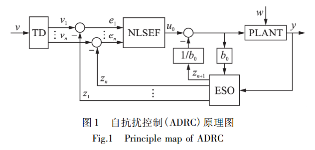
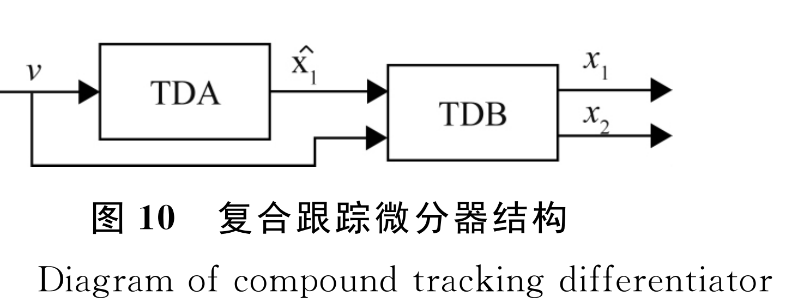

# ladrc & adrc

## 1.控制器框图

### 1.1 ADRC系统框图



### 1.2 LADRC系统框图


## 2.复合微分跟踪器

**（1）跟踪器作用说明**

​	微分跟踪器根据最速综合函数原理，有两个作用：1、原始信号跟踪（安排过度过程、滤波。）;2、提取一（高）阶微分信号，设定值单位是高度，一阶微分信号即速度。一般形式[H .Jq]的微分跟踪器存在问题，跟踪快速性和噪声放大的问题，因此采用复合微分跟踪器。

​	复合微分跟踪器的本质是，带前馈的微分跟踪器，复合微分跟踪器相比较于一般形式的微分从仿真结果看信号频率比较小的时候（< 5hz），白噪声协方差为输入正弦信号0.04的仿真情况下，跟踪相位滞后同一般形式的微分跟踪器小，一阶微分信号相差也不大，由于前馈的参数是定值，输入信号频率增大的时候，跟踪出来的信号会出现超调的问题（跟踪信号幅值比原始信号大）。


### 1.1 微分跟踪器

$$
\begin{align}
&\bold{General- form:一般形式（等效线性）微分跟踪器}\\
&\begin{cases}

\dot x_1(t) = x_2(t)\\
\dot x_2(t) = R^2[-k_1(x_1(t)-v(t)) - k_2\frac{x_2(t)}{R}]\\
\end{cases}\\
& f(.)：作用函数 \\
& f(.) = R^2[-k_1(x_1(t)-v(t)) - k_2\frac{x_2(t)}{R}] + \alpha \dot v(t)\\
& 只要f(.) 渐进稳定，x1(t) 收敛于 v(t)，x(2)t 收敛于\dot {v(t)}\\
\end{align}
$$

---


$$
\begin{align}
&\bold{General- Forward -Form:复合微分跟踪器}\\
& \\
&\begin{cases}

\dot x_1(t) = x_2(t)\\
\dot x_2(t) = R^2[-k_1(x_1(t)-v(t)) - k_2\frac{x_2(t)}{R}] + \alpha \dot v(t)\\


\end{cases}\\
\end{align}
$$

---

$$
\begin{align}
&\bold{Discrete- Forward-Form:复合微分跟踪器离散形式}\\
&\begin{cases}
T:sample-period\\
x_1(k+1)  = x_2(k)*T + x_1(k) \\
x_2(k+1)= x_2(k) + T[R^2 f(.)] + \alpha [v(k+1) - v(k)]\\
f(.)  = -k_1[x_1(t)-v(t)] - k_2\frac{x_2(t)}{R}\\
\end{cases}
\end{align}
$$
---

---

**系统跟踪输出与输入信号传递函数：**
$$
\begin{align}
& \bold{微分跟踪器参数调试依据}\\
& \frac{x_1}{v} = \frac{k_1R^2}{S^2 + k_2RS + k_1R^2}\\
& 系统固有频率:\omega _n = R*\sqrt{k_1},阻尼系数：\xi = \frac{k_2}{2*\sqrt{k_1}}\\

& \frac{x_2}{v} = \frac{R^2k_1S}{S^2 + Rk_2S+k_1R^2}\\
\end{align}
$$

### 1.2 系统框图





### 1.3 仿真结果

仿真参数：

```matlab
%{
TDA:2.2,1.3,15,5
TDB:2.2,2.8,150,40
%}

% 2019-12-1
TDA:2.2,1.3,30,15
TDB:2.2,2.8,30,18

```

仿真结果：阶跃信号跟踪10，高斯白噪：方差0，协方差：0.01


### 1.4 代码


```c
/*-----------------------ELDT_R1.h----------------------*/
#pragma once
/*
	微分跟踪器等效线性改进
*/

#define SAMPLE_PERIOD	2000

typedef struct
{
	int k1; 		// 线性等效参数
	int k2;			//
	int R;			
	int Fc;			// 前馈系数

}ELDTParam;

typedef struct
{
	int nTracker;			// 跟踪输出    x1(k+1)
	int nDiff;				// 估计微分输出 x2(k+1)
	int nForwardIn;			// 前馈补偿
	ELDTParam tTdParams;
}tELDT;

// functions
void ELDTrackerInit(tELDT* pSelf_, int nk1_, int nk2_, int nR_,int nFc_);

void ELDTrackerCalc(tELDT* pSelf_, int nTrackSignal_,int nFowardIn_);

void SetELDTrackerParam(tELDT* pSelf_, int nk1_, int nk2_, int nR_,int nFc_);

void TestELDTracker(void);


```


```c
#include "ELDT.h"


// 前馈补偿提取
tELDT g_ELDTA;
tELDT* g_pELDTA = &g_ELDTA;


// 主导微分跟踪器
tELDT g_ELDTB;
tELDT* g_pELDTB = &g_ELDTB;

/*
	@Function Description:
	1.初始化微分跟踪器;
	2.设置跟踪器系数;
*/
void ELDTrackerInit(tELDT* pSelf_, int nk1_, int nk2_, int nR_, int nFc_,int nVt_)
{
	pSelf_->tTdParams.k1 = nk1_;
	pSelf_->tTdParams.k2 = nk2_;
	pSelf_->tTdParams.R = nR_;
	pSelf_->tTdParams.Fc = nFc_;

	pSelf_->nDiff = 0;
	pSelf_->nTracker = nVt_;
	pSelf_->nForwardIn = nVt_;
}


void ELDTrackerCalc(tELDT* pSelf_, int nTrackSignal_, int nFowardIn_)
{
	// 局部变量非规范命名，方便分析原始公式
	int k1 = pSelf_->tTdParams.k1;
	int k2 = pSelf_->tTdParams.k2;
	int R = pSelf_->tTdParams.R;
	int a = pSelf_->tTdParams.Fc;

	int err_1 = pSelf_->nTracker - nTrackSignal_;

	pSelf_->nTracker = pSelf_->nTracker + pSelf_->nDiff / SAMPLE_PERIOD;
	pSelf_->nDiff = pSelf_->nDiff + (-k1 * err_1*R*R/10 - k2 * pSelf_->nDiff*R/10) / SAMPLE_PERIOD + a * (nFowardIn_ - pSelf_->nForwardIn);
	pSelf_->nForwardIn = nFowardIn_;
}

/*
	修改外部参数
*/
void SetELDTrackerParam(tELDT* pSelf_, int nk1_, int nk2_, int nR_, int nFc_)
{
	pSelf_->tTdParams.k1 = (pSelf_->tTdParams.k1 != nk1_ ? nk1_ : pSelf_->tTdParams.k1);
	pSelf_->tTdParams.k2 = (pSelf_->tTdParams.k2 != nk2_ ? nk2_ : pSelf_->tTdParams.k2);
	pSelf_->tTdParams.R = (pSelf_->tTdParams.R != nR_ ? nR_ : pSelf_->tTdParams.R);
	pSelf_->tTdParams.Fc = (pSelf_->tTdParams.Fc != nFc_ ? nFc_ : pSelf_->tTdParams.Fc);
}

/*
	GetELDT just need to return main track differntiator
*/
tELDT* GetELDT()
{
	return g_pELDTB;
}


/*
 * compound track differentiator
 * 为了保证系统跟踪器的收敛性，初始跟踪状态不设置为零
 */
void CompELDTInit(int nStateInit_)
{
	ELDTrackerInit(g_pELDTA, 22, 13, 30, 15,nStateInit_);
	/*
	 * TDB前馈系数设置为40阶跃响应存在超调
	 * */
	//1.2,4,36
	ELDTrackerInit(g_pELDTB, 12, 40, 36, 18,nStateInit_);
}

// arg_in:signal
tELDT* CompELDTUpdate(int nVt_)
{
	ELDTrackerCalc(g_pELDTA, nVt_, nVt_);
	ELDTrackerCalc(g_pELDTB, nVt_, g_pELDTA->nTracker);
}

```


## 3.ESO（扩张状态观测器）

### 3.1 被控对象数学模型

#### 1、

$$
\begin{align}
&\bold{单输入单输出（非线性）系统}\\
& \begin{cases} 

x^{(n)}(t) = f(t,x(t),\dot x(t), \ddot x(t),...x^{(n-1)}(t)) + \omega(t) + u(t)\\
y(t) = x(t)\\
 
\end{cases}\\
& x^{n}(t) ：n阶微分\\
& y(t) :系统输出，u(t)：系统输入
\end{align}
$$

#### 2、线性系统状态空间表达式

$$
\begin{align}
&\begin{cases}
\dot x_1(t) = x_2(t),x_1(0)=x_{10}\\
\dot x_2(t) = x_3(t),x_2(0)=x_{20}\\

.\\.\\.\\
\dot x_n(t) = f(t,x_1(t),...x_{n}(t)) + \omega(t) + u(t),x_{n0}(0) = x_{n0} \\
y(t) = x_1(t)
\end{cases}\\
&状态空间表达式:\\
&\begin{cases}
\dot x = Ax + Bu\\
y = Cx\\
系统状态选取：x_1 = y（位置）,x_2 = \dot y（速度）
\end{cases}\\


\end{align}
$$

#### 3.扩张观测器

$$
\begin{align}
&\bold{扩张状态观测器（本质是一个龙伯格观测器）：}\\
&系统状态选取：x_1 = y（位置）,x_2 = \dot y（速度）,x_3 = \ddot y(加速度|扩张状态)\\

&\begin{cases}
\widehat x = A\widehat x + Bu + L(y-\widehat y) \\
\widehat y = C\widehat x
\\
观测器参数L=[\beta1,\beta2,\beta3]
\end{cases}\\
\\ \\
\\

&\bold{扩张状态观测器连续形式：}\\
&\begin{cases}
\varepsilon_1 = x_1(t) - y\\
\dot x_1(t) = x_2(t) - \beta_1 \varepsilon_1\\
\dot x_2(t) = x_3(t) - \beta_2 \varepsilon_1 + b_0u\\
\dot x_3(t) = -\beta_3 \varepsilon_1\\
&\end{cases}\\
&u = \frac{-x_3(t)+u_0}{b_0} \\
& u :控制输入量
\\ \\
\\

&\bold{扩张状态观测器离散形式：}\\
& 离散方式：显示欧拉\\
&\begin{cases}
h:sample \space period \\
\varepsilon_1 = x_1(k) -y(k)\\
x_1(k+1) = x_1(k) + (x_2(t)-\beta_1\varepsilon_1)h\\
x_2(k+1) = x_2(k) + (x_3(k)-\beta_2 \varepsilon_1+ b_0u(k))h \\
x_3(k+1) = x_3(k) - \beta_3\varepsilon_1\\
\end{cases}\\


\end{align}
$$


#### 4.控制律

$$
\begin{align}
& 形式一（现在采用方式）：\\
& u_0 ：虚拟控制量 \\
& u_0 = kp*(track - \widehat x_1) + kd*(diff - \widehat x_2)\\
&track:微分跟踪器跟踪输出，diff ：微分跟踪器一阶导数\\

& 形式二：\\
& u_0 = kp*(r - y) + kd*(- \dot y)  \\
& r：设定值 ,\dot r 一阶导数 \\

& 形式三：\\
& u_0 = kp*(r - y) + kd*(\dot r - \dot y) + \ddot r \\
& r：设定值 ,\dot r 一阶导数 ,\ddot r 二阶导数 \\
&u(k) = \frac{u_0 - \widehat x_{n+1}}{b_0}\\
& b_0:估计等效控制增益\\
\end{align}
$$


关于线性扩张观测器参数整定，有一个通用公式（GetLADRCParam），

关于扩张观测器参数说明：

1.观测器带宽选取存在系统噪声放大和观测结果准确矛盾。

2.根据参数计算公式，参数上升很快，计算过程中会出现很大的值，（1E7 ）

3.b0：等效控制增益，越大对扰动抑制效果越明显，不合适会出现抖动问题。

4.采用形式一的控制律，暂时没有调试出满意的参数（仿真结果有比较满意效果）。

5.最终的控制输出量是速度，暂没尝试修改驱动器为转矩（加速度）控制模式。

6.现在调试的最好结果是，会出现两次超调峰值（0.3 mm 超调量），仿真（0.02mm超调量）。

```matlab
function GetLADRCParam(w0)
%{
    β1 = 3*ω0，β2 = 3*ω0^2 β3 = ω0^3,ω0(rad/s)是观测器带宽，
    现在使用参数：800,90,2700,27000
%}
    beta_1 = w0*w0;
    beta_2 = 3*beta_1;  
    beta_3 = w0*beta_1;
    fprintf('bandwidth of eso is %d rad/s,beta_1:%d,beta_2:%d,beta_3:%d\nParams:%d,%d,%d\n'...
        ,w0,beta_1,beta_2,beta_3,beta_1,beta_2,beta_3);
end
```


### 2.2 离散方式

**显示欧拉（前向差分）:**

**代码实现过程中，统一使用显示欧拉形式进行计算离散。**
$$
\begin{align}
&\Rightarrow\dot x_1(t) = x_2(t)\\
& \Rightarrow \frac{x_1(k+1) - x_1(k)}{h} = x_2(k)\\
&\Rightarrow x_1(k+1) = h*x_2(k) + x_1(k)\\
&采样周期h：[5e-4] ms (1/2000)\\
\end{align}
$$
**隐式欧拉（后向差分):**
$$
\begin{align}
&\Rightarrow\dot x_1(t) = x_2(t)\\
& \Rightarrow \frac{x_1(k) - x_1(k-1)}{h} = x_2(k)\\
&\Rightarrow x_1(k) = h*x_2(k-1) + x_1(k)\\

\end{align}
$$


### 2.4 代码 

#### ESO.h

```c
#ifndef ESO_H_
#define ESO_H_

// ESO(Extented State Observer)
// sample period(ms)
#define H_ESO 2000

#define MODEL_LESO 1

#if MODEL_LESO
// parameters of eso(second order)
typedef struct
{
	int beta_1;		// β1
	int beta_2;		// β2
	int beta_3;		// β3
	int b_0;		// b0
}ESOParam;

typedef struct
{
	int x_1;	// 一阶状态
	int x_2;	// 二阶
	int x_3;
	int y;
	int u;
	ESOParam param;	// 扩张观测器参数
}ESO;

// Linear ADRC
ESO* GetESO();

void EsoSetParamW(ESO* pSelf_, int b0_, int omega_);

void EsoSetParam(ESO* pSelf_, int b0_, int beta1_, int beta2_, int beta3_);

void ESOInit(ESO* pSelf_, int b0_, int beta1_, int beta2_, int beta3_,int nEncoder_,int nCtrl_);

void EsoUpdate(ESO* pSelf_, int u0_, int y_);

#else
// nonlinear extended state observer
// todo:

#endif
#endif

```

####  ESO.c

```c
#include "ESO.h"

// 使用全局变量的方式保存数据
ESO g_ESO;

ESO* GetESO()
{
	return &g_ESO;
}

/*
	参数设置
*/
void EsoSetParam(ESO* pSelf_, int b0_, int beta1_, int beta2_, int beta3_)
{
	pSelf_->param.b_0 = b0_ == pSelf_->param.b_0 ? b0_ : pSelf_->param.b_0;
	pSelf_->param.beta_1 = b0_ == pSelf_->param.beta_1 ? beta1_ : pSelf_->param.beta_1;
	pSelf_->param.beta_2 = b0_ == pSelf_->param.beta_2 ? beta2_ : pSelf_->param.beta_2;
	pSelf_->param.beta_3 = b0_ == pSelf_->param.beta_3 ? beta3_ : pSelf_->param.beta_3;
}

/*
	参数关系：
	β1 = 3*ω0，β2 = 3*ω0^2 β3 = ω0^3,ω0(rad/s)是观测器带宽，观测器带宽需要比系统带宽高；
	b0_:系统扰动系数,决定系统的抗扰动能力
*/
void EsoSetParamW(ESO* pSelf_, int b0_, int omega_)
{
	/*
		leso_t->beta1 = 2.0f*w;
		leso_t->beta2 = w*w;
		reference:
	*/
	pSelf_->param.b_0 = b0_;
	pSelf_->param.beta_1 = 3 * omega_;
	pSelf_->param.beta_2 = 3 * omega_*omega_;
	pSelf_->param.beta_3 = omega_ * omega_*omega_;
}
/*
	初始化需要考虑不同状态非零情况对控制结果（收敛速度的影响）
	通常不同阶状态应设置为非零；
*/
void ESOInit(ESO* pSelf_, int b0_, int beta1_, int beta2_, int beta3_,int nHeightUnitP_,int nCtrl_)
{
	pSelf_->param.b_0 = b0_;
	pSelf_->param.beta_1 = beta1_;
	pSelf_->param.beta_2 = beta2_;
	pSelf_->param.beta_3 = beta3_;

	pSelf_->u = nCtrl_;
	pSelf_->y = nHeightUnitP_;
	pSelf_->x_1 = nHeightUnitP_;
	pSelf_->x_2 = 0;
	pSelf_->x_3 = 0;
}

/*
	根据系统输入输出，估计系统内部不同阶状态
	过程向量:x = [z1(k),z2(k),z3(k)];
	输入向量:u = [y(k),u(k)];
	输入向量:x = [z1(k+1),z2(k+1),z3(k+1)];

	e = x(k) - y;
	x(1) = x(1) + h*(x(2) - beta1*e);
	x(2) = x(2) + h*(x(3) - beta2*e + b*u(1));
	x(3) = x(3) - h*beta3*e;

	reference:
	[1]H:\MatlabFiles\ADRC\Docs\ADRC.md
	[2]https://blog.csdn.net/handsome_for_kill/article/details/88398467
	[3]陈增强，程赟，孙明玮等，线性自抗扰控制理论及工程应用的若干进展，信息与控制，2017，46（03），257-266
	u_0:UnitV  y_:UnitP
*/
void EsoUpdate(ESO* pSelf_, int u0_, int y_)
{
	// UnitP
	int epsilon_1 = pSelf_->x_1 - y_;
	pSelf_->x_1 = pSelf_->x_1 + (pSelf_->x_2 - pSelf_->param.beta_1*epsilon_1)/ H_ESO;
	pSelf_->x_2 = pSelf_->x_2 + (pSelf_->x_3 - pSelf_->param.beta_2*epsilon_1 + pSelf_->param.b_0*u0_) / H_ESO;
	pSelf_->x_3 = pSelf_->x_3 - pSelf_->param.beta_3*epsilon_1 / H_ESO;
}


```


#### LADRC.h

```c
#ifndef LADRC_H_
#define LARDC_H_
#include "ELDT.h"
#include "ESO.h"
#include "global.h"
#include "FollowPID.h"

/*
	Compound TD
	Linear-ESO
*/
typedef struct
{
	int KP;			// 比例
	int KD;			// 微分
	ESO* pESO;		// 扩张观测器
	//tELDT* pTDA;	// 复合微分跟踪器(i)
	tELDT* pTDB;	// 复合微分跟踪器(ii)
	int nCtrl;		// 控制器输出
}LADRC;

// transfer data in different file
LADRC * GetLADRC();

// Linear Auto Disturbance Rejection Controller
void InitLADRC(LADRC* pSelf_,int nState1_,int nState2_,int nState3_,int nState4_);

int UpdateLADRC(LADRC* pSelf_,int nCapHeight_,int nEncoder_,int nCtrl_,int nRefHeight_);

/*
 * 控制器输出量映射为现有接口[-32768,32768]
 * 控制器设计独立于被控对象Motor_SetUnitV(Mapper)
 */

#ifdef SIMULATOR_PC
void SimulatorLADRC();
#endif

#endif

```


#### LADRC.c


```c
#include "LADRC.h"
#include "ELDT.h"
#include "FollowPID.h"
#include "CapSensor.h"

/*
	通过定义全局变量实现不同文件之间数据交换
*/
LADRC g_Ladrc;


LADRC * GetLADRC()
{
	return &g_Ladrc;
}
/*
	 Linear Auto Disturbance Rejection Controller
	 1.主要包括：扩张观测器、微分跟踪器、控制量输出、控制器参数的初始化
	 2.初始化扩张观测器、微分跟踪器是为了将eso.cpp & eltd.cpp中定义的两个结构体同LADRC(struct)进行数据绑定
	 3.非零初始化状态
	 nState1_:微分跟踪器位置状态
	 nState2_:位置状态
	 nState3_:速度状态
*/
void InitLADRC(LADRC* pSelf_,int nState1_,int nState2_,int nState3_,int nState4_)
{
	pSelf_->KP = 1200;
	pSelf_->KD = 1;
	pSelf_->pESO = GetESO();
	pSelf_->pTDB = GetELDT();
	pSelf_->nCtrl = nState4_;
	/*
	compound tracking differentiator
	*/
	CompELDTInit(nState1_);
	/*
		ESO prototype:
		void ESOInit(ESO* pSelf_, int b0_, int beta1_, int beta2_, int beta3_,int nEncoder_,int nCtrl_);
		ESO:b0 = 150,ω0 = 8,Kp = 280,kd = 2;
	*/
	//30,300,1000
	ESOInit(pSelf_->pESO,800,90,550,3320,nState2_,nState3_);
	//int _nState4 = nState4_;
}

/*
	update ladrc main function
	状态控制器输入：UnitV
	状态控制器输出：UnitP
*/
int UpdateLADRC(LADRC* pSelf_,int nCapHeight_,int nEncoder_,int nCtrl_,int nRefHeight_)
{
	tFollowPID* _pFollow = FollowPID_Get();

	// Control Out
	EsoUpdate(pSelf_->pESO, pSelf_->nCtrl, nCapHeight_);
	CompELDTUpdate(nRefHeight_);
	/*
		Virtual CtrlOut
		u(k) = (u0(k) - xn+1(k))/b0
		u0(k) = kp*(track(k) - x1(k)) + kd*(diff(k) - x2(k))
	*/
	int nPOut = pSelf_->KP*(pSelf_->pTDB->nTracker - pSelf_->pESO->x_1);
	int nDOut = pSelf_->KD*(pSelf_->pTDB->nDiff - pSelf_->pESO->x_2);
	int _nU_0 = nPOut + nDOut;
	int _nCtrlUnitV = (_nU_0 - pSelf_->pESO->x_3) / pSelf_->pESO->param.b_0;

#if TRUE
	// 输出饱和
	int _nMaxUnitV = _pFollow->pidParam.nVUnitV;
	if (_nCtrlUnitV < 0 && abs(_nCtrlUnitV) > abs(_nMaxUnitV))
	{
		_nCtrlUnitV = -1 * _nMaxUnitV;
	}

	/* limit acc*/
	int _nAccUnitV = _nCtrlUnitV - pSelf_->nCtrl;
	int _nDir = _nAccUnitV < 0 ? -1 : 1;
	if (abs(_nAccUnitV) > _pFollow->pidParam.nAccUnitV)
	{
		_nAccUnitV = _nDir * _pFollow->pidParam.nAccUnitV;
	}

	_nCtrlUnitV = pSelf_->nCtrl + _nAccUnitV;
#else
	/* limit acc*/

#endif
	pSelf_->nCtrl = _nCtrlUnitV;

#if TRUE
	int _nHeightUnitP = CapSensor_GetHeight(CapSensor_Get());
	int _nTargetHeightUnitP = _pFollow->pidParam.nFollowTargetUnitP;
	static int _s_nCnt = 0;
	LogValue(_s_nCnt++,_nHeightUnitP,pSelf_->pESO->x_1,pSelf_->pESO->x_2,
			_nTargetHeightUnitP,pSelf_->pTDB->nTracker,pSelf_->nCtrl);
#endif
	return _nCtrlUnitV;
}


```


##### FollowCtrl.c

```c
void Follow_OnStep(Follow* pSelf_)
{
	const tFollowParam* _pParam = GetFollowParam();
	FS_STATUS _state = pSelf_->state;

	switch (_state)
	{
	case FS_LOCKING:
		{
			Locking* _pLocking = Locking_Get();

			if (pSelf_->preState != FS_LOCKING)
				Locking_Init(_pLocking);
			Locking_OnStep(_pLocking);
			if (Locking_IsFinished(_pLocking))
			{	
				if (!pSelf_->bCompHeightError)
					pSelf_->state = FS_PREINTERPOLATE;
			}	
		}
		break;

	case FS_PREINTERPOLATE:
		{

			tMotorCtrl* _pMotor = Motor_Get();
			tFollowPID* _pFollowPID = FollowPID_Get();
			Interp* _pInterp = Interp_Get();

			if (pSelf_->preState != FS_PREINTERPOLATE)
			{
				InitPreInterpolate(pSelf_);
			}

			int _nHeightUnitP = CapSensor_GetHeight(CapSensor_Get());
			int _nFollowTargetUnitP = pSelf_->nFollowTargetUnitP;
			int _nMoveL = pSelf_->nFollowTargetUnitP - _nHeightUnitP - Interp_GetCachedL(_pInterp);

			Interp_GoDistance(_pInterp, _nMoveL);
			int _nInterpUnitStep = Interp_OnStep(_pInterp);
			int _nInterpUnitV = ConvertUnitStepToUnitV(_nInterpUnitStep);
			FollowPID_SetPreOutUnitV(_pFollowPID,  _nInterpUnitV);
			FollowPID_SetFollowTarget(_pFollowPID, _nFollowTargetUnitP);
			int _nFollowUnitV = FollowPID_OnStep(_pFollowPID);
			
			Motor_SetUnitV(_pMotor, _nInterpUnitV);
			int _nNextAcc = _nFollowUnitV - _nInterpUnitV;

			int _nAbsErr = abs(_nHeightUnitP - _nFollowTargetUnitP);

			// 上下运动过程加速度处理
			if (pSelf_->nDir * _nNextAcc < 0
				&& abs(_nNextAcc) <= _pFollowPID->pidParam.nAccUnitV 
				&& _nAbsErr <= ConvertLmmToUnitP(1))
			{
				FollowPID_SetPreOutUnitV(_pFollowPID, _nInterpUnitV);
				pSelf_->state = FS_PID_CONTROL;

				break;
			}
		}
		break;

	case FS_PID_CONTROL:
		{
			tFollowPID* _pFollowPID = FollowPID_Get();
			tGradientFollow* _pGradient = &pSelf_->gradientFollow;
			tFollowParam* _pParam = GetFollowParam();

			if (!pSelf_->bHasFollowed && FollowPID_HasFollowed(_pFollowPID))
			{
				pSelf_->bHasFollowed = TRUE;
				if (_pGradient->state == GRADIENT_FOLLOWING)
				{
					_pGradient->state = GRADIENT_IDLE;
					FollowPID_SetSpeedCtrlParam(_pFollowPID, _pParam->nPosVUnitStep, _pParam->nAccUnitStep);
				}
			}

			if (pSelf_->bHasFollowed || !pSelf_->bMachining)
			{
				// 非加工状态下，前馈开启后关闭抑振功能，防止对手动抖板造成影响。
				if (pSelf_->bMachining)
					FollowPID_SetSuppressMode(_pFollowPID, FOLLOWED_SUPPRESS);
				else if (FollowPID_IsEnableFeedForward(_pFollowPID))
					FollowPID_SetSuppressMode(_pFollowPID, NO_SUPPRESS);

				if (pSelf_->nForwardFeedEnableDelayTime > 0)
					pSelf_->nForwardFeedEnableDelayTime--;

				FollowPID_EnableFeedForward(_pFollowPID, pSelf_->nForwardFeedEnableDelayTime == 0 ? TRUE : FALSE);
			}

			//todo:边缘动态抑震不是很成熟，暂时屏蔽。 --陈豫
			//if (Monitoring(pSelf_))
			//{
			//	FollowPID_EnableFeedForward(_pFollowPID, FALSE);
			//	FollowPID_SetPIDParam(_pFollowPID, 1, 0);
			//}
			int _nFollowUnitV = FollowPID_OnStep(_pFollowPID);

			// 随动到位之后转为LADRC控制
			if (pSelf_->bHasFollowed && !pSelf_->bMachining)
			{
				// linear adrc
#if LADRC_INTE
				LADRC* _pLADRC =  GetLADRC();
				int _nHeightUnitP = CapSensor_GetHeight(CapSensor_Get());
				int _nEsoCapHeightUniP = _nHeightUnitP;
				int _nRefHeightUnitP = _pFollowPID->pidParam.nFollowTargetUnitP;
				int _nLadrcUnitV = UpdateLADRC(_pLADRC,_nEsoCapHeightUniP,0,_pLADRC->nCtrl,_nRefHeightUnitP);
#endif
				Motor_SetUnitV(Motor_Get(), _nLadrcUnitV);
			}
			else
			{
				// LADRC初始化
#if LADRC_INTE
				LADRC* _pLADRC =  GetLADRC();
				int _nHeightUnitP = CapSensor_GetHeight(CapSensor_Get());
				int _nTdCapHeightUnitP = _nHeightUnitP;
				int _nEsoCapHeightUnitP = _nHeightUnitP;
				int _nEsoCapVelStep = 0;
				InitLADRC(_pLADRC,_nTdCapHeightUnitP,_nEsoCapHeightUnitP,_nEsoCapVelStep,_nFollowUnitV);
#endif
				Motor_SetUnitV(Motor_Get(), _nFollowUnitV);
			}

			CheckForMissPanel(pSelf_);
			CheckForOutPanelEdge(pSelf_);
			
			if (_pGradient->state == GRADIENT_IDLE && HasGradientCmd(pSelf_))
			{
				PlanGradientFollow(pSelf_, &g_inputGradientCmd);
				_pGradient->state = GRADIENT_DELAYING;
			}

			if (_pGradient->state == GRADIENT_DELAYING && !DoGradientDelay(pSelf_))
			{
				_pGradient->state = GRADIENT_FOLLOWING;
				pSelf_->state = FS_LOCKING;
				break;
			}

			// 此处如果不做限制，第一次启动软件会概率性出现问题：先收到随动参数的高度，渐进动作消失，直接跳到目标位置。 --朱成坤
			if (_pGradient->state == GRADIENT_DELAYING || _pGradient->state == GRADIENT_FOLLOWING)
				break;

			//进入PID控制后，跟随高度发生变化，则进入插补控制 --陈豫
			//解决问题：跟随过程中，改变跟随高度，若高度变化较大，插补控制更平稳，且防止PID直接控制加速度设置过小导致的撞板。
			int _nFollowTargetUnitP = GetFollowTarget(pSelf_);

			// 渐进过程结束后速度、加速度需要切换到设定值 -朱成坤
			if (_nFollowTargetUnitP != pSelf_->nFollowTargetUnitP)
			{
				// pSelf_->state = FS_LOCKING;
				pSelf_->nFollowTargetUnitP = _nFollowTargetUnitP;
				// break;
			}
#ifdef SIN_GEN
			/*||
		 	 正弦跟踪信号测试
			 */
			// 补偿电容高度
			int _nCompedFollowTarget = 0;
			if (pSelf_->bHasFollowed && !pSelf_->bMachining)
			{
				_nCompedFollowTarget = GeneratSinDistubance();
				if(TRUE)
				{
					tELDT* _pEOU = GetELDT();
					tCapSensor* _pSensor = CapSensor_Get();
					static int _s_nCnt = 0;
					// void LogValue(int nNo_, int nV1_, int nV2_, int nV3_,int nV4_,int nV5_,int nV6_);
					LogValue(_s_nCnt++,_pSensor->nHeightUnitP/10,_pEOU->nTracker,_pEOU->nDiff,
							GetELDT_VS()->nTracker,GetELDT_VS()->nDiff,GetELDT_VS()->nForwardIn);
				}

			}
			_nCompedFollowTarget += _nFollowTargetUnitP;
			FollowPID_SetFollowTarget(_pFollowPID, _nCompedFollowTarget);
			FollowPID_SetPIDCoeff(_pFollowPID, _pParam->nFollowKp, _pParam->nFollowKd, 0);
#else
			const tCompHeightCmd* _pCompQueue = UpdateCompHeightQueue(pSelf_);
			if (_pCompQueue)
				pSelf_->nCompFollowTargetUnitP = _pCompQueue->nHeightUnitP;
			int _nCompedFollowTarget = _nFollowTargetUnitP + pSelf_->nCompFollowTargetUnitP;
			FollowPID_SetFollowTarget(_pFollowPID, _nCompedFollowTarget);
			FollowPID_SetPIDCoeff(_pFollowPID, _pParam->nFollowKp, _pParam->nFollowKd, 0);
#endif
		}
		break;

	default:
		break;
	}

	UpdateFollowedDurationT(pSelf_);
	if (_state != FS_PID_CONTROL && pSelf_->nCompFollowTargetUnitP != 0)
	{
		pSelf_->state = FS_LOCKING;
		pSelf_->bCompHeightError = TRUE;
	}

	pSelf_->preState = _state;
}
```


## 4.仿真实验方案

### 4.1 测试实验方案

- 正弦信号跟踪（理论）

- 阶跃信号测试（测试中）

- ITAE性能指标（理论）

- 抗扰动能力测试实验方案

  边缘开随动，振动抑制

- 首次开随动时间

- 参数简化


## 5. 关键（TODO）问题

1.控制器形式确定；

2.参数整定（微分跟踪器+PD参数）；


## 5.被控对象模型

（机理推断）速度控制方式：
$$
\begin{align}
& 积分环节+一阶惯性环节:
G(s) = \frac{b_0}{S(aS+1)}\\
& 
\end{align}
$$


System Identification:

```c
                16.75 (+/- 0.2556) s - 0.2331 (+/- 1.816)
            --------------------------------------------------
            s^2 + 0.3274 (+/- 0.1804) s + 0.06028 (+/- 0.3627)
```


