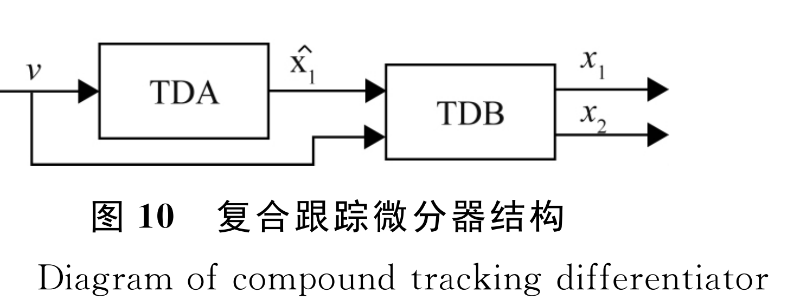
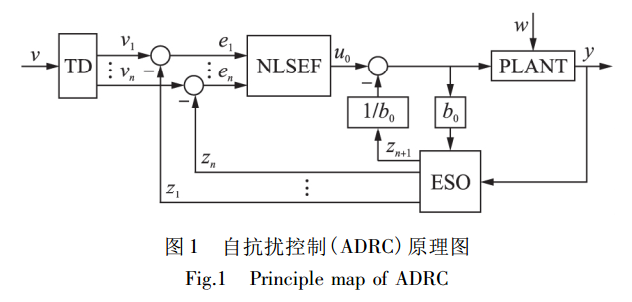
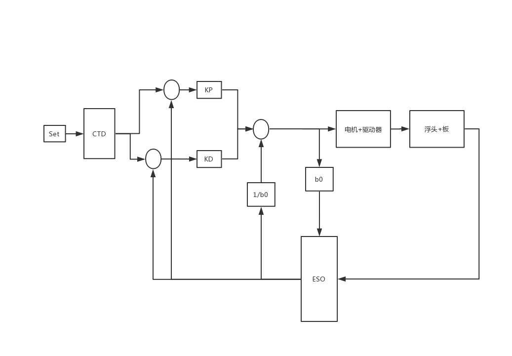
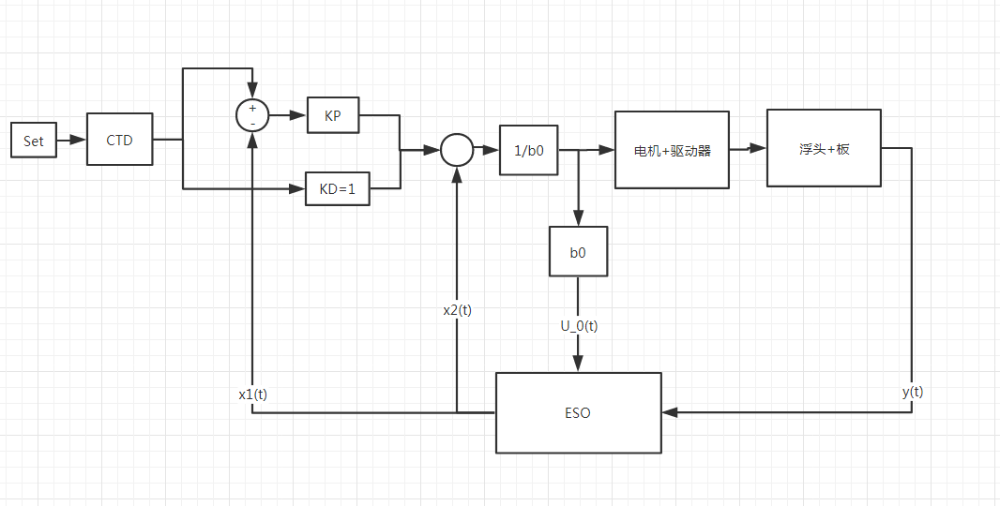
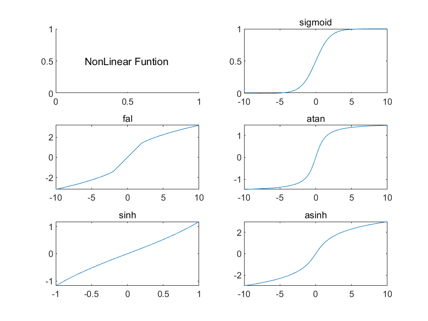

# ADRC-About

## 1.复合微分跟踪器

### 1.1 数学模型

$$
\begin{align}
&\bold{General- modle:}\\
&\begin{cases}

\dot x_1(t) = x_2(t)\\
\dot x_2(t) = R^2[-k_1(x_1(t)-v(t)) - k_2\frac{x_2(t)}{R}]\\
\end{cases}\\

\end{align}
$$


$$
\begin{align}
&\bold{General- Forward Modle:}\\
&\begin{cases}

\dot x_1(t) = x_2(t)\\
\dot x_2(t) = R^2[-k_1(x_1(t)-v(t)) - k_2\frac{x_2(t)}{R}] + \alpha \dot v(t)\\
\end{cases}\\
\end{align}
$$

$$
\begin{align}
&\bold{Discrete- ForwardModle:}\\
&\begin{cases}
T:sample-period\\
x_1(k+1)  = x_2(k)*T + x_1(k) \\
x_2(k+1)= x_2(k) + T[R^2 f(.)] + \alpha [v(k+1) - v(k)]\\
f(.)  = -k_1[x_1(t)-v(t)] - k_2\frac{x_2(t)}{R}\\
\end{cases}
\end{align}
$$
系统跟踪输出与输入信号传递函数：
$$
\begin{align}
& \frac{x_1}{v} = \frac{k_1R^2}{S^2 + k_2RS + k_1R^2}\\
& 系统固有频率:\omega _n = R*\sqrt{k_1},阻尼系数：\xi = \frac{k_2}{2*\sqrt{k_1}}\\

& \frac{x_2}{v} = \frac{R^2k_1S}{S^2 + Rk_2S+k_1R^2}\\
\end{align}
$$

### 1.2 系统框图

<center>

</center>


### 1.3 仿真结果

仿真参数：

```matlab
TDA:2.2,1.3,15,5
TDB:2.2,2.8,150,40

% 2019-12-1
TDA:2.2,1.3,30,15
TDB:2.2,2.8,30,40

% 存在超调问题
```

仿真结果：16.4 rad/s正弦信号，高斯白噪：方差0，协方差：0.04

<H:\MatlabFiles\ADRC\Figures\复合微分跟踪器仿真结果-1总览.fig>

<H:\MatlabFiles\ADRC\Figures\复合微分跟踪器仿真结果-2Track.fig>

### 1.4 代码

##### ELDT.h

```c
#ifndef ELDT_H_
#define ELDT_H_
#include "global.h"

// 1/4 查表实现sin函数
// #define SIN_GEN
#ifdef SIN_GEN

typedef struct
{
	int nIndex;
	int nFreSin;
	int nCnt;
}tSinDisturbance;

void InitSinDisturbance(int nFre_);

int GeneratSinDistubance();

tSinDisturbance* SinGet();

#endif
/*
	等效线性微分跟踪器
*/
#define SAMPLE_PERIOD	2000

typedef struct
{
	int k1; 		// 线性等效参数
	int k2;			//
	int R;
	int Fc;			// 前馈系数

}ELDTParam;

typedef struct
{
	int nTracker;			// 跟踪输出    x1(k+1)
	int nDiff;				// 估计微分输出 x2(k+1)
	int nForwardIn;			// 前馈补偿
	ELDTParam tTdParams;
}tELDT;

// functions
void ELDTrackerInit(tELDT* pSelf_, int nk1_, int nk2_, int nR_, int nFc_,int nVt_);

void ELDTrackerCalc(tELDT* pSelf_, int nTrackSignal_,int nFowardIn_);

void SetELDTrackerParam(tELDT* pSelf_, int nk1_, int nk2_, int nR_,int nFc_);

// compound tracker differentiator
void CompELDTInit(int nStateInit_);

// arg_in:signal
tELDT* CompELDTUpdate(int nVt_);

tELDT* GetELDT();
#endif

```

##### ELTD.c

```c
#include "ELDT.h"

// 查表实现正弦信号输出
#ifdef SIN_GEN
/*
	查表方式实现正弦
	默认采样周期为0.5ms
*/
#define SinSize 100
static int g_nSin[SinSize - 1] = {
	0,634,1266,1893,2511,3120,3717,4298,4862,5406,5929,6428,6901,7346,7761,
	8146,8497,8815,9096,9341,9549,9718,9848,9938,9989,9999,9969,9898,9788,
	9638,9450,9224,8960,8660,8326,7958,7557,7127,6668,6182,5671,5137,4582,
	4009,3420,2817,2203,1580,951,317,-317,-951,-1580,-2203,-2817,-3420,-4009,
	-4582,-5137,-5671,-6182,-6668,-7127,-7557,-7958,-8326,-8660,-8960,-9224,-9450,
	-9638,-9788,-9898,-9969,-9999,-9989,-9938,-9848,-9718,-9549,-9341,-9096,-8815,
	-8497,-8146,-7761,-7346,-6901,-6428,-5929,-5406,-4862,-4298,-3717,-3120,-2511,
	-1893,-1266,-634
};

// sin struct
tSinDisturbance g_SinDisturbance;
#endif


// 前馈补偿提取
tELDT g_ELDTA;
tELDT* g_pELDTA = &g_ELDTA;


// 主导微分跟踪器
tELDT g_ELDTB;
tELDT* g_pELDTB = &g_ELDTB;

#if DT_VS
// 对比微分跟踪器
tELDT g_ELDTC;
tELDT* g_pELDTC = &g_ELDTC;
#endif

/*
	@Function Description:
	1.初始化微分跟踪器;
	2.设置跟踪器系数;
*/
void ELDTrackerInit(tELDT* pSelf_, int nk1_, int nk2_, int nR_, int nFc_,int nVt_)
{
	pSelf_->tTdParams.k1 = nk1_;
	pSelf_->tTdParams.k2 = nk2_;
	pSelf_->tTdParams.R = nR_;
	pSelf_->tTdParams.Fc = nFc_;

	pSelf_->nDiff = 0;
	pSelf_->nTracker = nVt_;
	pSelf_->nForwardIn = nVt_;
}


void ELDTrackerCalc(tELDT* pSelf_, int nTrackSignal_, int nFowardIn_)
{
	// 局部变量非规范命名，方便分析原始公式
	int k1 = pSelf_->tTdParams.k1;
	int k2 = pSelf_->tTdParams.k2;
	int R = pSelf_->tTdParams.R;
	//int a = pSelf_->tTdParams.Fc;

	pSelf_->nTracker = (pSelf_->nTracker*SAMPLE_PERIOD + pSelf_->nDiff) / SAMPLE_PERIOD;
	int err_1 = pSelf_->nTracker - nTrackSignal_;
	// deadzone UnitP(50)
	pSelf_->nDiff = pSelf_->nDiff + (-k1 * err_1/10 - k2 * pSelf_->nDiff/10/R)*R*R / SAMPLE_PERIOD;// + a * (nFowardIn_ - pSelf_->nForwardIn);
	pSelf_->nForwardIn = nFowardIn_;
}

/*
	修改外部参数
*/
void SetELDTrackerParam(tELDT* pSelf_, int nk1_, int nk2_, int nR_, int nFc_)
{
	pSelf_->tTdParams.k1 = (pSelf_->tTdParams.k1 != nk1_ ? nk1_ : pSelf_->tTdParams.k1);
	pSelf_->tTdParams.k2 = (pSelf_->tTdParams.k2 != nk2_ ? nk2_ : pSelf_->tTdParams.k2);
	pSelf_->tTdParams.R = (pSelf_->tTdParams.R != nR_ ? nR_ : pSelf_->tTdParams.R);
	pSelf_->tTdParams.Fc = (pSelf_->tTdParams.Fc != nFc_ ? nFc_ : pSelf_->tTdParams.Fc);
}

/*
	GetELDT just need to return main track differntiator
*/
tELDT* GetELDT()
{
	return g_pELDTB;
}


#if DT_VS
tELDT* GetELDT_VS()
{
	return g_pELDTC;
}
#endif

/*
 * compound track differentiator
 * 为了保证系统跟踪器的收敛性，初始跟踪状态不设置为零
 */
void CompELDTInit(int nStateInit_)
{
	ELDTrackerInit(g_pELDTA, 22, 13, 30, 15,nStateInit_);
	/*
	 * TDB前馈系数设置为40阶跃响应存在超调
	 * 系数设置为12,,40,100微分跟踪器会出问题
	 */
	//ELDTrackerInit(g_pELDTB,12,40,100,0,nStateInit_);
	ELDTrackerInit(g_pELDTB,12,40,100,0,nStateInit_);
#if DT_VS
	ELDTrackerInit(g_pELDTC, 22, 28, 30, 0,nStateInit_);
#endif
}

// arg_in:signal
tELDT* CompELDTUpdate(int nVt_)
{
	ELDTrackerCalc(g_pELDTA, nVt_, nVt_);
	ELDTrackerCalc(g_pELDTB, nVt_, g_pELDTA->nTracker);
#if DT_VS
	ELDTrackerCalc(g_pELDTC, nVt_, nVt_);
#endif
	return g_pELDTB;
}


// 正弦扰动
#ifdef SIN_GEN

void InitSinDisturbance(int nFre_)
{
	g_SinDisturbance.nFreSin = (nFre_ > 0 ? nFre_ : 1);
	// 33A最大测试频率20hz，总线最大测试频率10hz
	g_SinDisturbance.nFreSin = (nFre_ <= 20 ? nFre_ : 20);
	g_SinDisturbance.nIndex = 0;
	g_SinDisturbance.nCnt = 0;
}

/*
	查表实现幅值固定，可变频率的正弦信号输出
	正弦数值表长，100;
	y(t) = sin(ωt);				...(1)
	T = 2*pi/ω;					...(2)
	Sample = 5e-4(1e-3)			...(3)
	δt = T/SinSize = 2*pi/(SinSize*ω)	...(4)
	δt = T/SinSize = 1/(SinSize*f)		...(5)
	f (hz)						...(6)
	cnt = δt/Sample = 20/f		...(7)

	/N.A/
	100*cnt*Sample = T;
	1/(100*cnt*Sample) = 20/cnt = f;
*/
int GeneratSinDistubance()
{
	// 测试10周期
	if (g_SinDisturbance.nIndex > (SinSize - 1) * 10)
	{
		g_SinDisturbance.nIndex = (SinSize - 1) * 10 - 1;
		return 0;
	}
	int _nRetSin = 0;
	int nPeriodCnt = 20 / g_SinDisturbance.nFreSin;
	if ((++g_SinDisturbance.nCnt) % nPeriodCnt == 0)
	{
		g_SinDisturbance.nCnt = 0;
		g_SinDisturbance.nIndex++;
	}
	// just for debug
	_nRetSin = g_nSin[(g_SinDisturbance.nIndex - 1) % (SinSize - 1)];
	return _nRetSin;
}


tSinDisturbance* SinGet()
{
	return &g_SinDisturbance;
}

#endif

```

### 1.5 数据越界问题

频率大于4hz就会出现数据越界问题；
$$
\begin{align}
& X_0 = [x_1(0),x_2(0)...,x_n(0)] \not= [0]
\end{align}
$$
初始状态容易会导致出现越界问题

## 2.ESO（Extented State Observer）

### 2.1 数学模型

**SISO n-dimensional nonlinear system:**
$$
\begin{align}
& \begin{cases} 
x^{(n)}(t) = f(t,x(t),\dot x(t), \ddot x(t),...x^{(n-1)}(t)) + \omega(t) + u(t)\\
y(t) = x(t)\\
\end{cases}
\end{align}
$$

**n-dimensional nonlinear system With Initial State:**
$$
\begin{align}
&\begin{cases}
\dot x_1(t) = x_2(t),x_1(0)=x_{10}\\
\dot x_2(t) = x_3(t),x_2(0)=x_{20}\\
.\\.\\.\\
\dot x_n(t) = f(t,x_1(t),...x_{n}(t)) + \omega(t) + u(t),x_{n0}(0) = x_{n0} \\
y(t) = x_1(t)
\end{cases}
\end{align}
$$

**Continuous ESO Model:**
$$
\begin{align}
&\begin{cases}
\varepsilon_1 = z_1(t) - y(t)\\
\dot z_1(t) = z_2(t) - \beta_{01}\varepsilon_1\\
\dot z_2(t) = z_3(t) - \beta_{02}fal(\varepsilon_1,\alpha_{01},\delta) + b_0u\\
\dot z_3(t) = -\beta_{03}fal(\varepsilon_1,\alpha_{02},\delta)\\
\end{cases}\\

\end{align}
$$


**Fal:**
$$
\begin{align}
&fal(\varepsilon,\alpha,\delta)=\begin{cases}
|\varepsilon|^2sgn(\varepsilon),|\varepsilon| > \delta,\\
\varepsilon /\delta^{1-\alpha} 
\end{cases}\delta >0\\
\end{align}
$$

**Discrete ESO Model:**
$$
\begin{align}
&T:系统采样周期，如果将其换成h,可以进行变步长操作;\\
&\begin{cases}
\varepsilon_1(k) = z_1(k) - y(k)\\
z_1(k) = z_1(k-1) + T(f_{first}(.))\\
z_2(k) = z_2(k-1) + T(f_{second}(.))\\
z_3(k) = z_3(k-1) + T(f_{third}(.))\\
\end{cases}
\end{align}
$$


**Continuous LSEO Model:**
$$
\begin{align}
&\begin{cases}
\varepsilon_1 = x_1(t) - y\\
\dot x_1(t) = x_2(t) - \beta_1 \varepsilon_1\\
\dot x_2(t) = x_3(t) - \beta_2 \varepsilon_1 + b_0u\\
\dot x_3(t) = -\beta_3 \varepsilon_1\\
&\end{cases}\\
&u = \frac{-x_3(t)+u_0}{b_0}
\end{align}
$$

**Discrete LSEO Model:**
$$
\begin{align}
&\begin{cases}
h:sample \space period \\
\varepsilon_1 = x_1(k) -y(k)\\
x_1(k+1) = x_1(k) + (x_2(t)-\beta_1\varepsilon_1)h\\
x_2(k+1) = x_2(k) + (x_3(k)-\beta_2 \varepsilon_1+ b_0u(k))h \\
x_3(k+1) = x_3(k) - \beta_3\varepsilon_1\\
\end{cases}
\end{align}
$$

### 2.3 ESO

#### 1.what？

  线性系统，在状态观测器的基础上${x_1.x_2,...x_n}$维状态，系统内部扰动+外部扰动扩张成${x_{n+1}}$状态，理论上分析，  for a linear system, the higher the observer gain is, the quicker the linear Luenberger observer converges to the system state 。状态观测器的本质是一个龙伯格观测器，亦或是高阶状态观测器。文献[1]中对其有效性的证明是从lyapunov函数的基础上证明其收敛性，通过收敛性判断其是否有效。从实际物理角度看，ESO的解释并没有能给出有效的解释。


[1] Active Disturbance Rejection Control for Nonlinear Systems: An Introduction

### 2.3 NLSEF(Nonlinear State Error Feedback)

**Discrete Model:**
$$
\begin{align}

&\begin{cases}
e_p(k) = v_1(k) - z_1(k),e_D(k) = v_2(k) - z_2(k),\\
u_0(k) = K_pfal(e_p,\alpha_p,\delta_p) + K_dfal(e_D,\alpha_D,\delta_D),\\
u(k) = u_0(k) - z_3(k)/b_0.
\end{cases}
\end{align}
$$

### 2.4 LADRCU

**Second Order Control Out:**
$$
\begin{align}
&u(k) = \frac{u_0 - \widehat x_{n+1}}{b_0}\\
& u_0 = kp*(track - \widehat x_1) + kd*(diff - \widehat x_2)\\
& b_0:估计等效控制增益\\
\end{align}
$$

```matlab
u(k) = （u0(k) - xn+1(k)）/b0
u0(k) = kp*(track(k) - x1(k)) + kd*(diff(k) - x2(k))
```


### 2.5 离散方式

**显示欧拉（前向差分）:**
$$
\begin{align}
&\Rightarrow\dot x_1(t) = x_2(t)\\
& \Rightarrow \frac{x_1(k+1) - x_1(k)}{h} = x_2(k)\\
&\Rightarrow x_1(k+1) = h*x_2(k) + x_1(k)\\

\end{align}
$$
**隐式欧拉（后向差分):**
$$
\begin{align}
&\Rightarrow\dot x_1(t) = x_2(t)\\
& \Rightarrow \frac{x_1(k) - x_1(k-1)}{h} = x_2(k)\\
&\Rightarrow x_1(k) = h*x_2(k-1) + x_1(k)\\

\end{align}
$$


### 2.6 调试参数

```
调试结果:
1.被控对象：典型二阶被控对象[3]  
2.调试参数：
ESO:b0 = 150,ω0 = 8,Kp = 280,kd = 2;
TD:α = 1e-2,δ = 5e6;

ESO:b0 = 1000 ω0 = 5,25,75,100


调试参数：30,300,1000

```

function GetLADRCParam(w0)

```matlab
function GetLADRCParam(w0)
%{
    β1 = 3*ω0，β2 = 3*ω0^2 β3 = ω0^3,ω0是观测器带宽，
%}
    beta_1 = w0*w0;
    beta_2 = 3*beta_1;  
    beta_3 = w0*beta_1;
    fprintf('bandwidth of eso is %d rad/s,beta_1:%d,beta_2:%d,beta_3:%d\nParams:%d,%d,%d\n'...
        ,w0,beta_1,beta_2,beta_3,beta_1,beta_2,beta_3);
end
```


### 2.8 Code

**LESO.m**

```matlab
%{
    函数说明：
    1.扩张状态观测器将系统视为串联积分形,一阶状态，二阶状态是系统的速度，加速度;
    2.二阶扩张观测器
    3.观测器参数，β1，β2，β3关系:
    β1 = 3*ω0，β2 = 3*ω0^2 β3 = ω0^3,ω0是观测器带宽，
    @Funcname:扩张观测器
    @param:beta1,观测器系数
    @param:beta3,观测器系数
    @param:beta2,观测器系数

    调试结果:
    1.被控对象：典型二阶被控对象[3]  
    2.调试参数：
    ESO:b0 = 150,ω0 = 8,Kp = 280,kd = 2;
    TD:α = 1e-2,δ = 5e6;
    
    
    reference:
    [1] 线性ADRC参数整定 https://blog.csdn.net/handsome_for_kill/article/details/88398467
    [2] 纪恩庆, 肖维荣. 二阶自抗扰控制器的参数简化[J]. 自动化仪表, 2007, 28(5).
    [3] H:\MatlabFiles\ADRC\Scripts\SystemModel_R1.m


%}
function [sys,x0,str,ts] = LADRC_ESO(t,x,u,flag,beta1,beta2,beta3)

switch flag,
    
    case 0,
        [sys,x0,str,ts] = mdlInitializeSizes;
        
    case 2,
        sys = mdlUpdate(t,x,u,beta1,beta2,beta3); 
        
    case 3,
        sys = mdlOutputs(t,x,u);
        
    case {1,4,9},
        sys = [];
        
    otherwise
        DAStudio.error('Simulink:blocks:unhandledFlag', num2str(flag));
        
end

% ==========================================================================

function [sys,x0,str,ts] = mdlInitializeSizes

sizes = simsizes;
sizes.NumContStates  = 0;
sizes.NumDiscStates  = 3;
sizes.NumOutputs     = 3;
% u(1) = y(k),u(2) = ctrl_u
sizes.NumInputs      = 2;
sizes.DirFeedthrough = 1;
sizes.NumSampleTimes = 1;
sys = simsizes(sizes);
x0  = [0,0,0];
str = [];
ts  = [1e-3 0];
% end mdlInitializeSizes


% ==========================================================================
%{
    过程向量:x = [z1(k),z2(k),z3(k)];
    输入向量:u = [y(k),u(k)];
    输入向量:x = [z1(k+1),z2(k+1),z3(k+1)];
%}
function sys = mdlUpdate(t,x,u,beta1,beta2,beta3)
T = 1e-2;
h = T;
e = x(1) - u(2);
% z = [z1(k),z2(k),z3(k)];
z = zeros(1,3);
Continuous_Sys = false;
if Continuous_Sys
    % 连续形式
    z1 = x(2) - beta1*e;
    z2 = x(3) - beta2*e + u(2);
    z3 = -beta3*e;
    x = [z1,z2,z3];
else
    z(1) = x(1) + h*(x(2) - beta1*e);
    z(2) = x(2) + h*(x(3) - beta2*e + u(1));
    z(3) = x(3) - h*beta3*e;
end
x(1) = z(1);
x(2) = z(2);
x(3) = z(3);

sys(1) = x(1);
sys(2) = x(2);
sys(3) = x(3);

%============================================================================
function sys = mdlOutputs(t,x,u)
sys(1) = x(1);
sys(2) = x(2);
sys(3) = x(3);
```

## 3.离散卷积

### 3.1

递归型的线性时不变因果系统，差分方程表示：
$$
\begin{align}
& y(n) = \sum_{i=0}^{M}a_iu(n-i) + \sum_{i=1}^{N}b_iy(n-i)\\
\end{align}
$$


### 3.2 Ref

1.[**Model.cpp**](C:\Users\Whtest\Desktop\Coder\RatherBe\Src\Model.cpp) | [**Model.h**](C:\Users\Whtest\Desktop\Coder\RatherBe\Src\Model.h) 


## 4.Kalman

#### 4.1原理解析

#### 4.2 代码

##### Kalman_Int.h

```c
#pragma once
/*
	kalman int version
	2019-11-6
*/
#include <minwindef.h>

#define KALMANFILTER 1

#if KALMANFILTER

typedef struct
{
	int nVarQ;			// 过程噪声方差
	int nVarR;			// 观测噪声方差
	int nPreX;			// X(k-1|k-1)后验状态
	int nKg;			// kalman增益
	int nP;				// 协方差
	int nXreal;			// 真实状态量
	int nZstate;		// Z(k-1|k-1)
	BOOL bInitFlag;		// 初始化状态标志
}tKalman;

tKalman* KalmanGet();

void KalmanInit(tKalman* pSelf_, int nVarQ_, int nVarR_, int nInitState_);

int KalmanProcess(tKalman* pSelf_, int nZk_, int nUk_);

BOOL EnableKalman(tKalman* pSelf_);

#endif
```


##### Kalman_Int.c

```c
#include "global.h"
#include "Kalman_Int.h"


/*
kalman滤波器设计思路：
1.Height(k) = A(A=1)*Height(k-1) + △HE(k) + w(k)[过程噪声]；
2.Z(k) = C(C=1)*Height(k) + δ(k)[观测噪声]；
3.随动到位之后开启；
4.降低不确定噪声的影响，通过编码器反馈校正电容查表高度；
5.int数据而非double存在精度损失；
*/

tKalman g_tKalman;

tKalman* KalmanGet()
{
	return &g_tKalman;
}

// nVarQ_：过程噪声  nVarR_:观测噪声
void KalmanInit(tKalman* pSelf_, int nVarQ_, int nVarR_, int nInitState_)
{
	nVarQ_ > 0 ? pSelf_->nVarQ = nVarQ_ : pSelf_->nVarQ = 0;
	nVarR_ > 0 ? pSelf_->nVarR = nVarR_ : pSelf_->nVarR = 0;
	pSelf_->nKg = 0;
	pSelf_->nP = 0;							// 初始化不为零
	pSelf_->nPreX = nInitState_;			// 初始状态x(k-1|k-1)
	pSelf_->nXreal = 0;
	pSelf_->nZstate = 0;
	pSelf_->bInitFlag = TRUE;
}

int KalmanProcess(tKalman* pSelf_, int nZk_, int nUk_)
{
	int _nRet = 0;
	int _nAs = 1;//A:状态矩阵
	/*
	X(k | k - 1) = X(k - 1 | k - 1) + u(k)		(1)	状态预测
	*/
	int _nXKK_1 = (pSelf_->nPreX)*_nAs + nUk_;

	/*
	P(k | k - 1) = P(k - 1 | k - 1) + Q			(2)	预测协方差
	*/
	int _nPkk_1 = pSelf_->nP + pSelf_->nVarQ;

	/*
	K(k)=P(k|k-1)/（P(k|k-1)+R）					(3)	更新kalman增益
	*/
	int _nKg = 1000 * _nPkk_1 / (_nPkk_1 + pSelf_->nVarR);
	pSelf_->nKg = _nKg;

	/*
	X(k|k)=X(k|k-1)+K(k)*（Z(k)-X(k|k-1)）		(4)	状态更新
	*/
	int _nXkk = _nXKK_1 + _nKg * (nZk_ - _nXKK_1) / 1000;
	pSelf_->nPreX = _nXkk;

	/*
	P(k|k)=（1-K(k)）*P(k|k-1)					(5)	滤波方差更新
	*/
	int _nPkk = (1000 - _nKg)*_nPkk_1 / 1000;
	pSelf_->nP = _nPkk;
	_nRet = _nXkk;
	return _nRet;
}

BOOL EnableKalman(tKalman* pSelf_)
{
	return TRUE;
}
```


## 5.ADRC

### 5.1 ADRC系统框图
<center>

</center>


### 5.2 LADRC系统框图

<center>
    
    <p style = "align:auto">
        PD+二阶扩张观测器
    </p>
    <p>
        输入量为转矩，驱动器需要调整为转矩控制模式
    </p>
    </center>


<center>
    
    <p style = "align:auto">
        PD+一阶扩张观测器（D = 1，现采用）
    </p>
    <p>
        输入量为速度控制量
    </p>
</center>


## 6.Simulation And Experimental analysis

### 6.1 测试实验方案

- 正弦信号跟踪（理论）

- 阶跃信号测试（理论）

- ITAE性能指标（理论）

- 抗扰动能力测试实验方案

  边缘开随动，振动抑制

- 首次开随动时间

- 参数简化

### 6.2Detail

1.关于稳态误差

1、稳态误差同加速度相关，无加速度限制不能正常使用；

2、如何确定控制量；

​	模型分析

​	

控制量输出应为转矩；

转矩控制对于驱动器来说，是否控制模式修改为转矩控制；

如果使用转矩控制，加速度，速度限制如何实现；

是否可以通过不修改驱动器参数的方式实现；

修改控制器形式


## 7.被控对象模型


速度控制方式：
$$
\begin{align}
& 积分环节+一阶惯性环节:
G(s) = \frac{b_0}{S(aS+1)}\\
& 
\end{align}
$$


System Identification:

```c
                16.75 (+/- 0.2556) s - 0.2331 (+/- 1.816)
            --------------------------------------------------
            s^2 + 0.3274 (+/- 0.1804) s + 0.06028 (+/- 0.3627)
```

$$
1.	不含作用函数导数项时n阶系统的状态空间表达式\\
$$

## 8.调试参数

### 8.1参数说明

  现有参数基本不变的前提下，如何进行参数匹配；从振动抑制和边缘的能力来调整参数关系；从刚度和抑振等级两个维度进行描述； 

**观测器参数**

```
[b0,β1,β2,β3] 
part 1
2000,90,2700,27000
```


**跟踪微分器参数**


**对参数的认识**

1.稳态之后控制器的性能只由观测器带宽和等效增益决定；

2.跟踪微分器参数负责随动的过渡过程和稳态之后关系不大；

**扩张状态观测器和系统性能关系(爬坡|抗扰)**

1.b0越大，稳定区域（ωo,ωc）面积越大，b0过大之后，会导致控制性能下降;

2.ωc = 10/ts[原始为5.8/ts],kp = ωc**ωc,kd = 2**ωc;

3.ωo = 4*ωc;

4.Generally, the larger the bandwidths are, the better the

disturbance rejection performance. Once the two

bandwidths are fixed, 1/b0 determines the gain of the

LADRC, thus the smaller b0 is, the better the disturbance

rejection performance. 

5.which shows that the load disturbance rejection performance can be increased with increasing b. 

**参数整定方法**
$$
\begin{align}
& step1:design\quad \omega_c \ \\
& step2:\omega_c = (5\to10)\omega_c \\
& step3:kp = \frac{\omega_c^2}{b_0}\\
& \beta_0 = \omega_o*2 \quad \beta_1 = \omega_o^2\\
\end{align}
$$


Q:

1.relationship of ωo and ωc?

2.how to understand the ωo and ωc?

3.depression of disturbance && rigid?


**性能描述方式**
$$
\begin{align}
 [disturbance,rigid] = f(b_0,\omega _c,\omega _o，td_{parameters})\\
\end{align}
$$
1.track time match eso ;

2.ωo & ωc & TD description means；


[1] Tuning method for second-order active disturbance rejection control 

I:\RecentDocs\2011CCC_ADRC_Tuning_2ndOrder.pdf


[2] Decentralized Active Disturbance Rejection Control for the Benchmark Refeigeration System

I:\RecentDocs\1-s2.0-S2405896318304427-main.pdf


[3] Tuning of linear active disturbance rejection controller with robustness specification


[4] Scaling and Bandwidth-Parameterization Based Controller Tuning  

I:\RecentDocs\Scaling and Bandwidth-Parameterization Based Controller Tunning.pdf


## 9.插补&ADRC切换条件

  为了验证边缘开随动，完全舍弃原有PID控制器代码，同时为了继续使用插补的优异性能，需要保留插补方式，同时也需要保证切换条件的可用性。

### 9.1 切换关键问题点

- 不影响第一次开随动的速度
- 保证到位时间
- 必须能够切入进去
- 切换时候不能有速度（甚至加速度反向跳变），此处涉及adrc非零初始状态问题；

### 9.2 实现方式

#### Way-1

使用现有切换方式，从开启随动就使用ADRC进行计算。

#### Way-2

以电容查表高度作为切换条件，e.g: 2mm :arrow_right: 1mm 通过TD安排过度过程，既然边缘高位阶跃都能停下来，此方法应该同样适用。

设计过程中，需要考虑插补滑动滤波和插补减速延时的影响。


## 10.波浪板测试

测试随动高度1mm条件下，波浪板跟随性能。快速性和稳定性之间的问题；


## 11.代码完善

### 11.1 算法修改影响项

<center>
    
</center>


## 12. 非线性函数

### 12.1 NonLinear

  Fal、Atan、Sinh，Asinh、Sigmoid、Sat等不同形式。

<center>
    
    <p style = "align:auto;font-family:'consoles';color:red;">
        NonLinear View 
    </p>
</center>

---

### 12.2 Fal

1.Fal滤波器原理
    大误差，小增益，小误差，大增益，有利于输出小变换性;
    sat(x,δ)
    fal(x,alpha,δ)
    0 < alpha < 1 ，alpha决定非线性度，效果类似于振动抑制；
    δ 决定线性段区间长度

2.兼容内外部数据循环计算

3.fal滤波器

```matlab
function y = fal(epec,alpha,delta)
if abs(epec) > delta
    y = abs(epec).^alpha.*sign(epec);
else
    y = epec./(delta^(1 - alpha));
end
```


## Todo Lists:

1.加速度&速度限制；

2.参数简化；

3.全局还是局部

（1）通过初始化状态实现全局或者局部工作

（2）通过外界条件实现

4.状态反馈控制、输出反馈控制、观测器；

5.零初始状态应该有问题；

6.先进性；

7.系统稳定判定方法：古典控制理论（劳斯稳定判据、nyquist stability ）；

8.问题分解；

阶跃性能测试；

9.是否可以将前馈的思想引进；

## Reflection:

1.Why it costs so long?

```
1.控制算法原理，涉及到线性控制系统算法。
2.仿真环境使用
3.对问题的认识
4.方式方法
5.算法研究流程：问题分析→模型分析→算法研究（学习）→算法仿真→部署实测
6.问题分析深度
7.范式：可能原因+验证方式
8.nicotin
9.专注度
```

