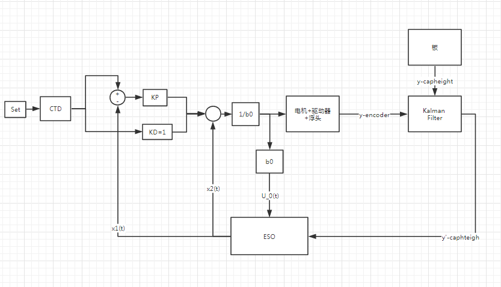
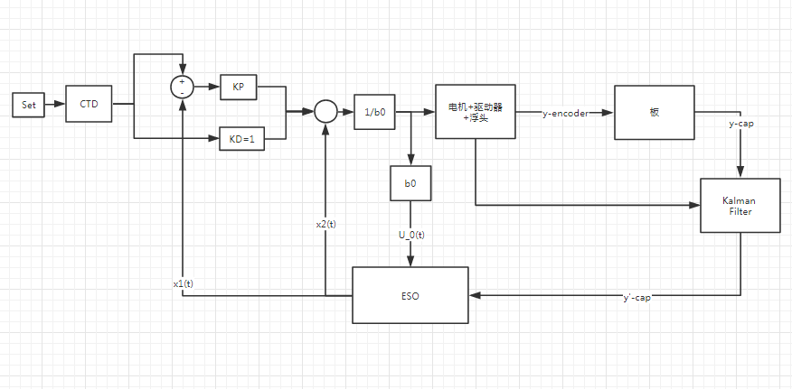

# ladrc & adrc

## 1.控制系统

### 1.1 被控对象数学模型

**1.1（机理推断）速度控制方式：**
$$
\begin{align}
& 积分环节+一阶惯性环节:
G(s) = \frac{b_0}{s(T_1s+1)}\\
& 
\end{align}
$$

**1.2 System Identification:**

```c
                16.75 (+/- 0.2556) s - 0.2331 (+/- 1.816)
            -------------------------------------------------- = G(s)
            s^2 + 0.3274 (+/- 0.1804) s + 0.06028 (+/- 0.3627)
```


### 1.2 系统框图

**2.1 ADRC系统框图**


**2.2 LADRC系统框图**

<center>
    
    <p style = "align:auto">
        PD+一阶扩张观测器（D = 1，现采用）
    </p>
    <p>
        输入量为速度控制量
    </p>
</center>

 ADRC(active disturbance rejection control)相对于LADRC(linear active disturbance rejection control)最大的区别在于是否采用Fal非线性函数，Fal函数形式比较复杂，也有很多不同的其他形式，比如改进sigmoid、tanh、反双曲正弦；非线性函数参数比较多，不容易调试。LADRC采用了线性形式代替ADRC中非线性函数。需要调试的参数较小，但非线性函数的使用是否能获得更好的控制效果有待验证。

<center>
    <p>
    </p>
    
    <p style = "align:auto;font-family:'consoles';">
        kalman-version1(Todo) 
    </p>
    <p>
    通过Kalman滤波器对输出位置偏差进行滤波
</p>
</center>


<center>
    <p> 
    </p>
    
    <p style = "align:auto;font-family:'consoles';color:'255 23 43'">
        kalman-version2(Todo) 
    </p>
    <p>
    通过Kalman滤波器对输出位置偏差进行滤波
</p>
</center>


  扩张状态观测器具有扰动估计的能力，扰动估计能力是否足够应对比较极端的情况，比如说反馈系数偏差很大，管切过楞的抖动情况。此外状态观测器设计上有个前提，noise free(即假设系统反馈端不存在噪声)。无Kalman系统是将随动头包括加工工件视为一体，都作为被控对象，加入kalman滤波器的系统是将切割头和板分开为两个子系统处理；无Kalman滤波器系统没有使用编码器的反馈信息，同电容传感器反馈信息比较，编码器反馈的信息更为精准，包含系统外部扰动小。通过信息融合的方式，加入编码器反馈可以可能效果会更好，关于kalman滤波器的测试效果，之前在尝试解决管切抖纹的时候使用过，经过kalman滤波之后的管切过楞高度反馈相比较于直接从电容查表获得的反馈更为精准、噪声更小。使用非线性函数（Fal、Sigmoid、Sinh、Atan）为了降低计算复杂度，使用查表的方式实现；


## 2.复合微分跟踪器

**（1）跟踪器作用说明**

​	微分跟踪器根据最速综合函数原理，有两个作用：1、原始信号跟踪（安排过度过程、滤波。）;2、提取一（高）阶微分信号，设定值单位是高度，一阶微分信号即速度。一般形式[H .Jq]的微分跟踪器存在问题，跟踪快速性和噪声放大的问题，因此采用复合微分跟踪器。

​	复合微分跟踪器的本质是，带前馈的微分跟踪器，复合微分跟踪器相比较于一般形式的微分从仿真结果看信号频率比较小的时候（< 5hz），白噪声协方差为输入正弦信号0.04的仿真情况下，跟踪相位滞后同一般形式的微分跟踪器小，一阶微分信号相差也不大，由于前馈的参数是定值，输入信号频率增大的时候，跟踪出来的信号会出现超调的问题（跟踪信号幅值比原始信号大）。


### 2.1 微分跟踪器

$$
\begin{align}
&\bold{General- form:一般形式（等效线性）微分跟踪器}\\
&\begin{cases}

\dot x_1(t) = x_2(t)\\
\dot x_2(t) = R^2[-k_1(x_1(t)-v(t)) - k_2\frac{x_2(t)}{R}]\\
\end{cases}\\
& f(.)：作用函数 \\
& f(.) = R^2[-k_1(x_1(t)-v(t)) - k_2\frac{x_2(t)}{R}] + \alpha \dot v(t)\\
& 只要f(.) 渐进稳定，x1(t) 收敛于 v(t)，x(2)t 收敛于\dot {v(t)}\\
\end{align}
$$

---


$$
\begin{align}
&\bold{General- Forward -Form:复合微分跟踪器}\\
& \\
&\begin{cases}

\dot x_1(t) = x_2(t)\\
\dot x_2(t) = R^2[-k_1(x_1(t)-v(t)) - k_2\frac{x_2(t)}{R}] + \alpha \dot v(t)\\


\end{cases}\\
\end{align}
$$

---

$$
\begin{align}
&\bold{Discrete- Forward-Form:复合微分跟踪器离散形式}\\
&\begin{cases}
T:sample-period\\
x_1(k+1)  = x_2(k)*T + x_1(k) \\
x_2(k+1)= x_2(k) + T[R^2 f(.)] + \alpha [v(k+1) - v(k)]\\
f(.)  = -k_1[x_1(t)-v(t)] - k_2\frac{x_2(t)}{R}\\
\end{cases}
\end{align}
$$
---

---

**系统跟踪输出与输入信号传递函数：**
$$
\begin{align}
& \bold{微分跟踪器参数调试依据}\\
& \frac{x_1}{v} = \frac{k_1R^2}{S^2 + k_2RS + k_1R^2}\\
& 系统固有频率:\omega _n = R*\sqrt{k_1},阻尼系数：\xi = \frac{k_2}{2*\sqrt{k_1}}\\

& \frac{x_2}{v} = \frac{R^2k_1S}{S^2 + Rk_2S+k_1R^2}\\
\end{align}
$$

### 2.2 系统框图


### 2.3 仿真结果

仿真参数：

```matlab
%{
TDA:2.2,1.3,15,5
TDB:2.2,2.8,150,40
%}

% 2019-12-1
TDA:2.2,1.3,30,15
TDB:2.2,2.8,30,18

```

仿真结果：阶跃信号跟踪10，高斯白噪：方差0，协方差：0.01

<center>
    
    <p style = "align:auto">
        跟踪输出
    </p>
</center>


<center>
    
    <p style = "align:auto">
        微分信号估计
    </p>
</center>


### 2.4 代码

##### ELDT.h

```c
/*-----------------------ELDT_R1.h----------------------*/
#ifndef ELDT_H_
#define ELDT_H_
#include "global.h"

// 1/4 查表实现sin函数
// #define SIN_GEN
#ifdef SIN_GEN

typedef struct
{
	int nIndex;
	int nFreSin;
	int nCnt;
}tSinDisturbance;

void InitSinDisturbance(int nFre_);

int GeneratSinDistubance();

tSinDisturbance* SinGet();

#endif
/*
	等效线性微分跟踪器
*/
#define SAMPLE_PERIOD	2000

typedef struct
{
	int k1; 		// 线性等效参数
	int k2;			//
	int R;
	int Fc;			// 前馈系数

}ELDTParam;

typedef struct
{
	int nTracker;			// 跟踪输出    x1(k+1)
	int nDiff;				// 估计微分输出 x2(k+1)
	int nForwardIn;			// 前馈补偿
	ELDTParam tTdParams;
}tELDT;

// functions
void ELDTrackerInit(tELDT* pSelf_, int nk1_, int nk2_, int nR_, int nFc_,int nVt_);

void ELDTrackerCalc(tELDT* pSelf_, int nTrackSignal_,int nFowardIn_);

void SetELDTrackerParam(tELDT* pSelf_, int nk1_, int nk2_, int nR_,int nFc_);

// compound tracker differentiator
void CompELDTInit(int nStateInit_);

// arg_in:signal
tELDT* CompELDTUpdate(int nVt_);

tELDT* GetELDT();
#endif

```

##### ELDT.c

```c
#include "ELDT.h"

// 查表实现正弦信号输出
#ifdef SIN_GEN
/*
	查表方式实现正弦
	默认采样周期为0.5ms
*/
#define SinSize 100
static int g_nSin[SinSize - 1] = {
	0,634,1266,1893,2511,3120,3717,4298,4862,5406,5929,6428,6901,7346,7761,
	8146,8497,8815,9096,9341,9549,9718,9848,9938,9989,9999,9969,9898,9788,
	9638,9450,9224,8960,8660,8326,7958,7557,7127,6668,6182,5671,5137,4582,
	4009,3420,2817,2203,1580,951,317,-317,-951,-1580,-2203,-2817,-3420,-4009,
	-4582,-5137,-5671,-6182,-6668,-7127,-7557,-7958,-8326,-8660,-8960,-9224,-9450,
	-9638,-9788,-9898,-9969,-9999,-9989,-9938,-9848,-9718,-9549,-9341,-9096,-8815,
	-8497,-8146,-7761,-7346,-6901,-6428,-5929,-5406,-4862,-4298,-3717,-3120,-2511,
	-1893,-1266,-634
};

// sin struct
tSinDisturbance g_SinDisturbance;
#endif


// 前馈补偿提取
tELDT g_ELDTA;
tELDT* g_pELDTA = &g_ELDTA;


// 主导微分跟踪器
tELDT g_ELDTB;
tELDT* g_pELDTB = &g_ELDTB;

#if DT_VS
// 对比微分跟踪器
tELDT g_ELDTC;
tELDT* g_pELDTC = &g_ELDTC;
#endif

/*
	@Function Description:
	1.初始化微分跟踪器;
	2.设置跟踪器系数;
*/
void ELDTrackerInit(tELDT* pSelf_, int nk1_, int nk2_, int nR_, int nFc_,int nVt_)
{
	pSelf_->tTdParams.k1 = nk1_;
	pSelf_->tTdParams.k2 = nk2_;
	pSelf_->tTdParams.R = nR_;
	pSelf_->tTdParams.Fc = nFc_;

	pSelf_->nDiff = 0;
	pSelf_->nTracker = nVt_;
	pSelf_->nForwardIn = nVt_;
}


void ELDTrackerCalc(tELDT* pSelf_, int nTrackSignal_, int nFowardIn_)
{
	// 局部变量非规范命名，方便分析原始公式
	int k1 = pSelf_->tTdParams.k1;
	int k2 = pSelf_->tTdParams.k2;
	int R = pSelf_->tTdParams.R;
	//int a = pSelf_->tTdParams.Fc;

	pSelf_->nTracker = (pSelf_->nTracker*SAMPLE_PERIOD + pSelf_->nDiff) / SAMPLE_PERIOD;
	int err_1 = pSelf_->nTracker - nTrackSignal_;
	// deadzone UnitP(50)
	pSelf_->nDiff = pSelf_->nDiff + (-k1 * err_1/10 - k2 * pSelf_->nDiff/10/R)*R*R / SAMPLE_PERIOD;// + a * (nFowardIn_ - pSelf_->nForwardIn);
	pSelf_->nForwardIn = nFowardIn_;
}

/*
	修改外部参数
*/
void SetELDTrackerParam(tELDT* pSelf_, int nk1_, int nk2_, int nR_, int nFc_)
{
	pSelf_->tTdParams.k1 = (pSelf_->tTdParams.k1 != nk1_ ? nk1_ : pSelf_->tTdParams.k1);
	pSelf_->tTdParams.k2 = (pSelf_->tTdParams.k2 != nk2_ ? nk2_ : pSelf_->tTdParams.k2);
	pSelf_->tTdParams.R = (pSelf_->tTdParams.R != nR_ ? nR_ : pSelf_->tTdParams.R);
	pSelf_->tTdParams.Fc = (pSelf_->tTdParams.Fc != nFc_ ? nFc_ : pSelf_->tTdParams.Fc);
}

/*
	GetELDT just need to return main track differntiator
*/
tELDT* GetELDT()
{
	return g_pELDTB;
}


#if DT_VS
tELDT* GetELDT_VS()
{
	return g_pELDTC;
}
#endif

/*
 * compound track differentiator
 * 为了保证系统跟踪器的收敛性，初始跟踪状态不设置为零
 */
void CompELDTInit(int nStateInit_)
{
	ELDTrackerInit(g_pELDTA, 22, 13, 30, 15,nStateInit_);
	/*
	 * TDB前馈系数设置为40阶跃响应存在超调
	 * 系数设置为12,,40,100微分跟踪器会出问题
	 */
	//ELDTrackerInit(g_pELDTB,12,40,100,0,nStateInit_);
	ELDTrackerInit(g_pELDTB,12,40,100,0,nStateInit_);
#if DT_VS
	ELDTrackerInit(g_pELDTC, 22, 28, 30, 0,nStateInit_);
#endif
}

// arg_in:signal
tELDT* CompELDTUpdate(int nVt_)
{
	ELDTrackerCalc(g_pELDTA, nVt_, nVt_);
	ELDTrackerCalc(g_pELDTB, nVt_, g_pELDTA->nTracker);
#if DT_VS
	ELDTrackerCalc(g_pELDTC, nVt_, nVt_);
#endif
	return g_pELDTB;
}


// 正弦扰动
#ifdef SIN_GEN

void InitSinDisturbance(int nFre_)
{
	g_SinDisturbance.nFreSin = (nFre_ > 0 ? nFre_ : 1);
	// 33A最大测试频率20hz，总线最大测试频率10hz
	g_SinDisturbance.nFreSin = (nFre_ <= 20 ? nFre_ : 20);
	g_SinDisturbance.nIndex = 0;
	g_SinDisturbance.nCnt = 0;
}

/*
	查表实现幅值固定，可变频率的正弦信号输出
	正弦数值表长，100;
	y(t) = sin(ωt);				...(1)
	T = 2*pi/ω;					...(2)
	Sample = 5e-4(1e-3)			...(3)
	δt = T/SinSize = 2*pi/(SinSize*ω)	...(4)
	δt = T/SinSize = 1/(SinSize*f)		...(5)
	f (hz)						...(6)
	cnt = δt/Sample = 20/f		...(7)

	/N.A/
	100*cnt*Sample = T;
	1/(100*cnt*Sample) = 20/cnt = f;
*/
int GeneratSinDistubance()
{
	// 测试10周期
	if (g_SinDisturbance.nIndex > (SinSize - 1) * 10)
	{
		g_SinDisturbance.nIndex = (SinSize - 1) * 10 - 1;
		return 0;
	}
	int _nRetSin = 0;
	int nPeriodCnt = 20 / g_SinDisturbance.nFreSin;
	if ((++g_SinDisturbance.nCnt) % nPeriodCnt == 0)
	{
		g_SinDisturbance.nCnt = 0;
		g_SinDisturbance.nIndex++;
	}
	// just for debug
	_nRetSin = g_nSin[(g_SinDisturbance.nIndex - 1) % (SinSize - 1)];
	return _nRetSin;
}


tSinDisturbance* SinGet()
{
	return &g_SinDisturbance;
}

#endif

```


## 3.ESO（扩张状态观测器）

### 3.1 被控对象数学模型

#### 1、一类非线性形式被控对象

$$
\begin{align}
&\bold{单输入单输出（非线性）系统}\\
& \begin{cases} 

x^{(n)}(t) = f(t,x(t),\dot x(t), \ddot x(t),...x^{(n-1)}(t)) + \omega(t) + u(t)\\
y(t) = x(t)\\
 
\end{cases}\\
& x^{n}(t) ：n阶微分\\
& y(t) :系统输出，u(t)：系统输入
\end{align}
$$

#### 2、线性系统状态空间表达式

$$
\begin{align}
&\begin{cases}
\dot x_1(t) = x_2(t),x_1(0)=x_{10}\\
\dot x_2(t) = x_3(t),x_2(0)=x_{20}\\

.\\.\\.\\
\dot x_n(t) = f(t,x_1(t),...x_{n}(t)) + \omega(t) + u(t),x_{n0}(0) = x_{n0} \\
y(t) = x_1(t)
\end{cases}\\
&状态空间表达式:\\
&\begin{cases}
\dot x = Ax + Bu\\
y = Cx\\
系统状态选取：x_1 = y（位置）,x_2 = \dot y（速度）
\end{cases}\\


\end{align}
$$

#### 3.扩张观测器

$$
\begin{align}
&\bold{扩张状态观测器（本质是一个龙伯格观测器）：}\\
&系统状态选取：x_1 = y（位置）,x_2 = \dot y（速度）,x_3 = \ddot y(加速度|扩张状态)\\

&\begin{cases}
\widehat x = A\widehat x + Bu + L(y-\widehat y) \\
\widehat y = C\widehat x
\\
观测器参数L=[\beta1,\beta2,\beta3]
\end{cases}\\
\\ \\
\\

&\bold{扩张状态观测器连续形式：}\\
&\begin{cases}
\varepsilon_1 = x_1(t) - y\\
\dot x_1(t) = x_2(t) - \beta_1 \varepsilon_1\\
\dot x_2(t) = x_3(t) - \beta_2 \varepsilon_1 + b_0u\\
\dot x_3(t) = -\beta_3 \varepsilon_1\\
&\end{cases}\\
&u = \frac{-x_3(t)+u_0}{b_0} \\
& u :控制输入量
\\ \\
\\

&\bold{扩张状态观测器离散形式：}\\
& 离散方式：显示欧拉\\
&\begin{cases}
h:sample \space period \\
\varepsilon_1 = x_1(k) -y(k)\\
x_1(k+1) = x_1(k) + (x_2(t)-\beta_1\varepsilon_1)h\\
x_2(k+1) = x_2(k) + (x_3(k)-\beta_2 \varepsilon_1+ b_0u(k))h \\
x_3(k+1) = x_3(k) - \beta_3\varepsilon_1\\
\end{cases}\\


\end{align}
$$


#### 4.控制律

$$
\begin{align}
& 形式一：\\
& u_0 ：虚拟控制量 \\
& u_0 = kp*(track - \widehat x_1) + kd*(diff - \widehat x_2)\\
&track:微分跟踪器跟踪输出，diff ：微分跟踪器一阶导数\\

& 形式二：\\
& u_0 = kp*(r - y) + kd*(- \dot y)  \\
& r：设定值 ,\dot r 一阶导数 \\

& 形式三（现采用方式）：\\
& u_0 = kp*(r - y) + kd*(\dot r - \dot y) + \ddot r (现在采用方式)\\
& r：设定值 ,\dot r 一阶导数 ,\ddot r 二阶导数 \\
&u(k) = \frac{u_0 - \widehat x_{n+1}}{b_0}\\
& b_0:估计等效控制增益\\
\end{align}
$$


关于线性扩张观测器参数整定，有一个通用公式（GetLADRCParam），

```matlab
function GetLADRCParam(w0)
%{
    β1 = 3*ω0，β2 = 3*ω0^2 β3 = ω0^3,ω0(rad/s)是观测器带宽，
    现在使用参数：800,90,2700,27000
%}
    beta_1 = w0*w0;
    beta_2 = 3*beta_1;  
    beta_3 = w0*beta_1;
    fprintf('bandwidth of eso is %d rad/s,beta_1:%d,beta_2:%d,beta_3:%d\nParams:%d,%d,%d\n'...
        ,w0,beta_1,beta_2,beta_3,beta_1,beta_2,beta_3);
end
```

关于扩张观测器参数说明：

1.观测器带宽选取存在系统噪声放大和观测结果准确矛盾。

2.根据参数计算公式，参数上升很快，计算过程中会出现很大的值，（1E7 ）

3.b0：等效控制增益，越大对扰动抑制效果越明显，不合适会出现抖动问题。

4.最终的控制输出量是速度，暂没尝试修改驱动器为转矩（加速度）控制模式。

5.采用控制形式三；


### 3.2 离散方式

**显示欧拉（前向差分）:**

**代码实现过程中，统一使用显示欧拉形式进行计算离散。**
$$
\begin{align}
&\Rightarrow\dot x_1(t) = x_2(t)\\
& \Rightarrow \frac{x_1(k+1) - x_1(k)}{h} = x_2(k)\\
&\Rightarrow x_1(k+1) = h*x_2(k) + x_1(k)\\
&采样周期h：[5e-4] ms (1/2000)\\
\end{align}
$$
**隐式欧拉（后向差分):**
$$
\begin{align}
&\Rightarrow\dot x_1(t) = x_2(t)\\
& \Rightarrow \frac{x_1(k) - x_1(k-1)}{h} = x_2(k)\\
&\Rightarrow x_1(k) = h*x_2(k-1) + x_1(k)\\

\end{align}
$$


### 3.4 对于ESO限幅的思考

##### 1.参考高增益观测器

控制器设计中，通常会存在快速性和噪声敏感性之间的矛盾，ESO同样如此。此外还存在峰值现象（'peaking' phenomenon），从频域分析角度看，ESO参数随着级数增大速度上升很大，超过三阶就很容易出现溢出问题，但是实际情况是，不会有这么大的值出现，已有的解决方案是对于高阶状态进行限幅。对ESO高阶状态限幅，直观理解是类似于输出饱和以及加速度限制，两种方式并存（[TodoList](验证有效性)）。

[ From High Gain Observer](https://www.researchgate.net/post/What_are_the_advantages_of_a_High-Gain_observer_in_comparison_to_standard_observers_like_ELO_EKF_or_UKF_without_time-consuming_high-gain_operations)

 扩张状态（x2(t)）表示速度，UnitP/5e-4ms  = 2000 UnitP/ms；另外一种操作方式是对其加速度进行限制。

##### 2.使用kalman方式

 使用kalman滤波之后的电容位置作为输出量。

### 3.5 代码 

#### ESO.h

```c
#ifndef ESO_H_
#define ESO_H_

// ESO(Extented State Observer)
// sample period(ms)
#define H_ESO 2000

#define MODEL_LESO 1

#if MODEL_LESO
// parameters of eso(second order)
typedef struct
{
	int beta_1;		// β1
	int beta_2;		// β2
	int beta_3;		// β3
	int b_0;		// b0
}ESOParam;

typedef struct
{
	int x_1;	// 一阶状态
	int x_2;	// 二阶
	int x_3;
	int y;
	int u;
	ESOParam param;	// 扩张观测器参数
}ESO;

// Linear ADRC
ESO* GetESO();

void EsoSetParamW(ESO* pSelf_, int b0_, int omega_);

void EsoSetParam(ESO* pSelf_, int b0_, int beta1_, int beta2_, int beta3_);

void ESOInit(ESO* pSelf_, int b0_, int beta1_, int beta2_, int beta3_,int nEncoder_,int nCtrl_);

void EsoUpdate(ESO* pSelf_, int u0_, int y_);

#else
// nonlinear extended state observer
// todo:

#endif
#endif

```

####  ESO.c

```c
#include "ESO.h"

// 使用全局变量的方式保存数据
ESO g_ESO;

ESO* GetESO()
{
	return &g_ESO;
}
#if CONTROLLER_ORDER==1
void ESOInit(ESO* pSelf_, int b0_, int beta1_, int beta2_, int nHeightUnitP_, int nCtrlUnitV_)
{
	pSelf_->param.b_0 = b0_;
	pSelf_->param.beta_1 = beta1_;
	pSelf_->param.beta_2 = beta2_;

	pSelf_->u = nCtrlUnitV_;
	pSelf_->y = nHeightUnitP_;
	pSelf_->x_1 = nHeightUnitP_;
	pSelf_->x_2 = 0;
}

void EsoUpdate(ESO* pSelf_, int u0_, int y_)
{
	// UnitP
	int epsilon_1 = y_ - pSelf_->x_1;
	pSelf_->x_1 = pSelf_->x_1 + (pSelf_->x_2 + pSelf_->param.beta_1*epsilon_1 + pSelf_->param.b_0*u0_) / H_ESO;
	/*
	  peak phenomno |δpSelf_->x_2| < a 扰动加速度限制
	 */
	pSelf_->x_2 = pSelf_->x_2 + pSelf_->param.beta_2*epsilon_1 / H_ESO;
}
#else
/*
	初始化需要考虑不同状态非零情况对控制结果（收敛速度的影响）
	通常不同阶状态应设置为非零；
*/
void ESOInit(ESO* pSelf_, int b0_, int beta1_, int beta2_, int beta3_,int nHeightUnitP_,int nCtrl_)
{
	pSelf_->param.b_0 = b0_;
	pSelf_->param.beta_1 = beta1_;
	pSelf_->param.beta_2 = beta2_;
	pSelf_->param.beta_3 = beta3_;

	pSelf_->u = nCtrl_;
	pSelf_->y = nHeightUnitP_;
	pSelf_->x_1 = nHeightUnitP_;
	pSelf_->x_2 = 0;
	pSelf_->x_3 = 0;
}

/*
	根据系统输入输出，估计系统内部不同阶状态
	过程向量:x = [z1(k),z2(k),z3(k)];
	输入向量:u = [y(k),u(k)];
	输入向量:x = [z1(k+1),z2(k+1),z3(k+1)];

	e = y - x(k) ;
	x(1) = x(1) + h*(x(2) + beta1*e);
	x(2) = x(2) + h*(x(3) + beta2*e + b*u(1));
	x(3) = x(3) + h*beta3*e;

	reference:
	[1]H:\MatlabFiles\ADRC\Docs\ADRC.md
	[2]https://blog.csdn.net/handsome_for_kill/article/details/88398467
	[3]陈增强，程赟，孙明玮等，线性自抗扰控制理论及工程应用的若干进展，信息与控制，2017，46（03），257-266
	u_0:UnitV  y_:UnitP
*/
void EsoUpdate(ESO* pSelf_, int u0_, int y_)
{
	// UnitP
	int epsilon_1 = pSelf_->x_1 - y_;
	pSelf_->x_1 = pSelf_->x_1 + (pSelf_->x_2 - pSelf_->param.beta_1*epsilon_1)/ H_ESO;
	pSelf_->x_2 = pSelf_->x_2 + (pSelf_->x_3 - pSelf_->param.beta_2*epsilon_1 + pSelf_->param.b_0*u0_) / H_ESO;
	pSelf_->x_3 = pSelf_->x_3 - pSelf_->param.beta_3*epsilon_1 / H_ESO;
}
#endif


```


#### LADRC.h

```c
#ifndef LADRC_H_
#define LARDC_H_
#include "ELDT.h"
#include "ESO.h"
#include "global.h"
#include "FollowPID.h"

/*
	Compound TD
	Linear-ESO
*/

#if CONTROLLER_ORDER == 1
typedef struct
{
	int KP;			// 比例
	ESO* pESO;		// 扩张观测器
	//tELDT* pTDA;	// 复合微分跟踪器(i)
	tELDT* pTDB;	// 复合微分跟踪器(ii)
	int nCtrl;		// 控制器输出
}LADRC;

LADRC * GetLADRC();

void InitLADRC(LADRC* pSelf_,int nDTHeightUnitP_,int nESOHeightUnitP_,int nCtrlUnitV_);

int UpdateLADRC(LADRC* pSelf_,int nCapHeightUnitP_,int nCtrlUnitV_,int nTargetHeightUnitP_);

#else
typedef struct
{
	int KP;			// 比例
	int KD;			// 微分
	ESO* pESO;		// 扩张观测器
	//tELDT* pTDA;	// 复合微分跟踪器(i)
	tELDT* pTDB;	// 复合微分跟踪器(ii)
	int nCtrl;		// 控制器输出
}LADRC;

// transfer data in different file
LADRC * GetLADRC();

// Linear Auto Disturbance Rejection Controller
void InitLADRC(LADRC* pSelf_,int nState1_,int nState2_,int nState3_);

int UpdateLADRC(LADRC* pSelf_,int nCapHeight_,int nEncoder_,int nCtrl_,int nRefHeight_);
#endif
/*
 * 控制器输出量映射为现有接口[-32768,32768]
 * 控制器设计独立于被控对象Motor_SetUnitV(Mapper)
 */

#ifdef SIMULATOR_PC
void SimulatorLADRC();
#endif

#endif

```

#### LADRC.c

```c
#include "LADRC.h"
#include "ELDT.h"
#include "FollowPID.h"
#include "CapSensor.h"

/*
	通过定义全局变量实现不同文件之间数据交换
*/
LADRC g_Ladrc;

LADRC * GetLADRC()
{
	return &g_Ladrc;
}
/*
	 Linear Auto Disturbance Rejection Controller
	 1.主要包括：扩张观测器、微分跟踪器、控制量输出、控制器参数的初始化
	 2.初始化扩张观测器、微分跟踪器是为了将eso.cpp & eltd.cpp中定义的两个结构体同LADRC(struct)进行数据绑定
	 3.非零初始化状态
	 nState1_:微分跟踪器位置状态
	 nState2_:位置状态
	 nState3_:速度状态
*/
void InitLADRC(LADRC* pSelf_,int nDTHeightUnitP_,int nESOHeightUnitP_,int nCtrlUnitV_)
{
	pSelf_->KP = 100;
	pSelf_->pESO = GetESO();
	pSelf_->pTDB = GetELDT();
	pSelf_->nCtrl = nCtrlUnitV_;
	/*
		compound tracking differentiator
	*/
	CompELDTInit(nDTHeightUnitP_);
	/*
		ESO prototype:
		void ESOInit(ESO* pSelf_, int b0_, int beta1_, int beta2_, int nHeight_, int nCtrl_)
	*/
	ESOInit(pSelf_->pESO,100,270,24300,nESOHeightUnitP_,nCtrlUnitV_);
}

/*
	update ladrc main function
	状态控制器输入：UnitV
	状态控制器输出：速度
*/
int UpdateLADRC(LADRC* pSelf_,int nCapHeightUnitP_,int nCtrlUnitV_,int nTargetHeightUnitP_)
{
	tFollowPID* _pFollow = FollowPID_Get();

	// Control Out
	EsoUpdate(pSelf_->pESO, nCtrlUnitV_, nCapHeightUnitP_);
	//ELDTrackerCalc(g_pELDTB, nVt_, g_pELDTA->nTracker);
	CompELDTUpdate(nTargetHeightUnitP_);
	/*
		Virtual CtrlOut
		u(k) = (u0(k) - xn+1(k))/b0
		u0(k) = kp*(track(k) - x1(k)) + kd*(diff(k) - x2(k))
	*/
#if CONTROLLER_ORDER == 1
	int nPOut = pSelf_->KP*(pSelf_->pTDB->nTracker - pSelf_->pESO->x_1)/10;
	int nDOut = pSelf_->pTDB->nDiff;
	int _nU_0 = nPOut + nDOut;
	int _nCtrlUnitV = (_nU_0 - pSelf_->pESO->x_2) / pSelf_->pESO->param.b_0;
#endif
	// why limit acc does exist accrue problems
	// 输出饱和
	int _nMaxUnitV = _pFollow->pidParam.nVUnitV;
	if (_nCtrlUnitV < 0 && abs(_nCtrlUnitV) > abs(_nMaxUnitV))
	{
		_nCtrlUnitV = -1 * _nMaxUnitV;
	}

	/* limit acc*/
	int _nAccUnitV = _nCtrlUnitV - pSelf_->nCtrl;
	int _nDir = _nAccUnitV < 0 ? -1 : 1;
	if (abs(_nAccUnitV) > _pFollow->pidParam.nAccUnitV)
	{
		_nAccUnitV = _nDir * _pFollow->pidParam.nAccUnitV;
	}

	_nCtrlUnitV = pSelf_->nCtrl + _nAccUnitV;
	pSelf_->nCtrl = _nCtrlUnitV;
#if TRUE
	int _nHeightUnitP = CapSensor_GetHeight(CapSensor_Get());

	static int _s_nCnt = 0;
	LogValue(_s_nCnt++,_nHeightUnitP,pSelf_->pESO->x_1,pSelf_->pESO->x_2,
			nTargetHeightUnitP_,pSelf_->pTDB->nTracker,pSelf_->pTDB->nDiff);
#endif
	return _nCtrlUnitV;
}


```


#### FollowCtrl.c

```c
void Follow_OnStep(Follow* pSelf_)
{
	const tFollowParam* _pParam = GetFollowParam();
	FS_STATUS _state = pSelf_->state;

	switch (_state)
	{
	case FS_LOCKING:
		{
			Locking* _pLocking = Locking_Get();

			if (pSelf_->preState != FS_LOCKING)
				Locking_Init(_pLocking);
			Locking_OnStep(_pLocking);
			if (Locking_IsFinished(_pLocking))
			{	
				if (!pSelf_->bCompHeightError)
					pSelf_->state = FS_PREINTERPOLATE;
			}	
		}
		break;

	case FS_PREINTERPOLATE:
		{

			tMotorCtrl* _pMotor = Motor_Get();
			tFollowPID* _pFollowPID = FollowPID_Get();
			Interp* _pInterp = Interp_Get();

			if (pSelf_->preState != FS_PREINTERPOLATE)
			{
				InitPreInterpolate(pSelf_);
			}

			int _nHeightUnitP = CapSensor_GetHeight(CapSensor_Get());
			int _nFollowTargetUnitP = pSelf_->nFollowTargetUnitP;
			int _nMoveL = pSelf_->nFollowTargetUnitP - _nHeightUnitP - Interp_GetCachedL(_pInterp);

			Interp_GoDistance(_pInterp, _nMoveL);
			int _nInterpUnitStep = Interp_OnStep(_pInterp);
			int _nInterpUnitV = ConvertUnitStepToUnitV(_nInterpUnitStep);
			FollowPID_SetPreOutUnitV(_pFollowPID,  _nInterpUnitV);
			FollowPID_SetFollowTarget(_pFollowPID, _nFollowTargetUnitP);
			int _nFollowUnitV = FollowPID_OnStep(_pFollowPID);
			
			Motor_SetUnitV(_pMotor, _nInterpUnitV);
			int _nNextAcc = _nFollowUnitV - _nInterpUnitV;

			int _nAbsErr = abs(_nHeightUnitP - _nFollowTargetUnitP);

			// 上下运动过程加速度处理
			if (pSelf_->nDir * _nNextAcc < 0
				&& abs(_nNextAcc) <= _pFollowPID->pidParam.nAccUnitV 
				&& _nAbsErr <= ConvertLmmToUnitP(1))
			{
				FollowPID_SetPreOutUnitV(_pFollowPID, _nInterpUnitV);
				pSelf_->state = FS_PID_CONTROL;

				break;
			}
		}
		break;

	case FS_PID_CONTROL:
		{
			tFollowPID* _pFollowPID = FollowPID_Get();
			tGradientFollow* _pGradient = &pSelf_->gradientFollow;
			tFollowParam* _pParam = GetFollowParam();

			if (!pSelf_->bHasFollowed && FollowPID_HasFollowed(_pFollowPID))
			{
				pSelf_->bHasFollowed = TRUE;
				if (_pGradient->state == GRADIENT_FOLLOWING)
				{
					_pGradient->state = GRADIENT_IDLE;
					FollowPID_SetSpeedCtrlParam(_pFollowPID, _pParam->nPosVUnitStep, _pParam->nAccUnitStep);
				}
			}

			if (pSelf_->bHasFollowed || !pSelf_->bMachining)
			{
				// 非加工状态下，前馈开启后关闭抑振功能，防止对手动抖板造成影响。
				if (pSelf_->bMachining)
					FollowPID_SetSuppressMode(_pFollowPID, FOLLOWED_SUPPRESS);
				else if (FollowPID_IsEnableFeedForward(_pFollowPID))
					FollowPID_SetSuppressMode(_pFollowPID, NO_SUPPRESS);

				if (pSelf_->nForwardFeedEnableDelayTime > 0)
					pSelf_->nForwardFeedEnableDelayTime--;

				FollowPID_EnableFeedForward(_pFollowPID, pSelf_->nForwardFeedEnableDelayTime == 0 ? TRUE : FALSE);
			}

			//todo:边缘动态抑震不是很成熟，暂时屏蔽。 --陈豫
			//if (Monitoring(pSelf_))
			//{
			//	FollowPID_EnableFeedForward(_pFollowPID, FALSE);
			//	FollowPID_SetPIDParam(_pFollowPID, 1, 0);
			//}
			int _nFollowUnitV = FollowPID_OnStep(_pFollowPID);

			// 随动到位之后转为LADRC控制
			if (pSelf_->bHasFollowed && !pSelf_->bMachining)
			{
				// linear adrc
#if LADRC_INTE
				LADRC* _pLADRC =  GetLADRC();
				int _nEsoCapHeightUnitP = CapSensor_GetHeight(CapSensor_Get());
				int _nRefHeightUnitP = _pFollowPID->pidParam.nFollowTargetUnitP;
				int _nLadrcUnitV = UpdateLADRC(_pLADRC,_nEsoCapHeightUnitP,_pLADRC->nCtrl,_nRefHeightUnitP);
#endif
				Motor_SetUnitV(Motor_Get(), _nLadrcUnitV);
			}
			else
			{
				// LADRC初始化
#if LADRC_INTE
				LADRC* _pLADRC =  GetLADRC();
				int _nHeightUnitP = CapSensor_GetHeight(CapSensor_Get());
				int _nTdCapHeightUnitP = _nHeightUnitP;
				int _nEsoCapHeightUnitP = _nHeightUnitP;
				InitLADRC(_pLADRC,_nTdCapHeightUnitP,_nEsoCapHeightUnitP,_nFollowUnitV);
#endif
				Motor_SetUnitV(Motor_Get(), _nFollowUnitV);
			}

			CheckForMissPanel(pSelf_);
			CheckForOutPanelEdge(pSelf_);
			
			if (_pGradient->state == GRADIENT_IDLE && HasGradientCmd(pSelf_))
			{
				PlanGradientFollow(pSelf_, &g_inputGradientCmd);
				_pGradient->state = GRADIENT_DELAYING;
			}

			if (_pGradient->state == GRADIENT_DELAYING && !DoGradientDelay(pSelf_))
			{
				_pGradient->state = GRADIENT_FOLLOWING;
				pSelf_->state = FS_LOCKING;
				break;
			}

			// 此处如果不做限制，第一次启动软件会概率性出现问题：先收到随动参数的高度，渐进动作消失，直接跳到目标位置。 --朱成坤
			if (_pGradient->state == GRADIENT_DELAYING || _pGradient->state == GRADIENT_FOLLOWING)
				break;

			//进入PID控制后，跟随高度发生变化，则进入插补控制 --陈豫
			//解决问题：跟随过程中，改变跟随高度，若高度变化较大，插补控制更平稳，且防止PID直接控制加速度设置过小导致的撞板。
			int _nFollowTargetUnitP = GetFollowTarget(pSelf_);

			// 渐进过程结束后速度、加速度需要切换到设定值 -朱成坤
			if (_nFollowTargetUnitP != pSelf_->nFollowTargetUnitP)
			{
				// pSelf_->state = FS_LOCKING;
				pSelf_->nFollowTargetUnitP = _nFollowTargetUnitP;
				// break;
			}
#ifdef SIN_GEN
			/*||
		 	 正弦跟踪信号测试
			 */
			// 补偿电容高度
			int _nCompedFollowTarget = 0;
			if (pSelf_->bHasFollowed && !pSelf_->bMachining)
			{
				_nCompedFollowTarget = GeneratSinDistubance();
				if(TRUE)
				{
					tELDT* _pEOU = GetELDT();
					tCapSensor* _pSensor = CapSensor_Get();
					static int _s_nCnt = 0;
					// void LogValue(int nNo_, int nV1_, int nV2_, int nV3_,int nV4_,int nV5_,int nV6_);
					LogValue(_s_nCnt++,_pSensor->nHeightUnitP/10,_pEOU->nTracker,_pEOU->nDiff,
							GetELDT_VS()->nTracker,GetELDT_VS()->nDiff,GetELDT_VS()->nForwardIn);
				}

			}
			_nCompedFollowTarget += _nFollowTargetUnitP;
			FollowPID_SetFollowTarget(_pFollowPID, _nCompedFollowTarget);
			FollowPID_SetPIDCoeff(_pFollowPID, _pParam->nFollowKp, _pParam->nFollowKd, 0);
#else
			const tCompHeightCmd* _pCompQueue = UpdateCompHeightQueue(pSelf_);
			if (_pCompQueue)
				pSelf_->nCompFollowTargetUnitP = _pCompQueue->nHeightUnitP;
			int _nCompedFollowTarget = _nFollowTargetUnitP + pSelf_->nCompFollowTargetUnitP;
			FollowPID_SetFollowTarget(_pFollowPID, _nCompedFollowTarget);
			FollowPID_SetPIDCoeff(_pFollowPID, _pParam->nFollowKp, _pParam->nFollowKd, 0);
#endif
		}
		break;

	default:
		break;
	}

	UpdateFollowedDurationT(pSelf_);
	if (_state != FS_PID_CONTROL && pSelf_->nCompFollowTargetUnitP != 0)
	{
		pSelf_->state = FS_LOCKING;
		pSelf_->bCompHeightError = TRUE;
	}

	pSelf_->preState = _state;
}
```


## 4.Kalman

#### 4.1原理解析

#### 4.2 代码

##### Kalman_Int.h

```c
#pragma once
/*
	kalman int version
	2019-11-6
*/
#include <minwindef.h>

#define KALMANFILTER 1

#if KALMANFILTER

typedef struct
{
	int nVarQ;			// 过程噪声方差
	int nVarR;			// 观测噪声方差
	int nPreX;			// X(k-1|k-1)后验状态
	int nKg;			// kalman增益
	int nP;				// 协方差
	int nXreal;			// 真实状态量
	int nZstate;		// Z(k-1|k-1)
	BOOL bInitFlag;		// 初始化状态标志
}tKalman;

tKalman* KalmanGet();

void KalmanInit(tKalman* pSelf_, int nVarQ_, int nVarR_, int nInitState_);

int KalmanProcess(tKalman* pSelf_, int nZk_, int nUk_);

BOOL EnableKalman(tKalman* pSelf_);

#endif
```


##### Kalman_Int.c

```c
#include "global.h"
#include "Kalman_Int.h"


/*
kalman滤波器设计思路：
1.Height(k) = A(A=1)*Height(k-1) + △HE(k) + w(k)[过程噪声]；
2.Z(k) = C(C=1)*Height(k) + δ(k)[观测噪声]；
3.随动到位之后开启；
4.降低不确定噪声的影响，通过编码器反馈校正电容查表高度；
5.int数据而非double存在精度损失；
*/

tKalman g_tKalman;

tKalman* KalmanGet()
{
	return &g_tKalman;
}

// nVarQ_：过程噪声  nVarR_:观测噪声
void KalmanInit(tKalman* pSelf_, int nVarQ_, int nVarR_, int nInitState_)
{
	nVarQ_ > 0 ? pSelf_->nVarQ = nVarQ_ : pSelf_->nVarQ = 0;
	nVarR_ > 0 ? pSelf_->nVarR = nVarR_ : pSelf_->nVarR = 0;
	pSelf_->nKg = 0;
	pSelf_->nP = 0;							// 初始化不为零
	pSelf_->nPreX = nInitState_;			// 初始状态x(k-1|k-1)
	pSelf_->nXreal = 0;
	pSelf_->nZstate = 0;
	pSelf_->bInitFlag = TRUE;
}

int KalmanProcess(tKalman* pSelf_, int nZk_, int nUk_)
{
	int _nRet = 0;
	int _nAs = 1;//A:状态矩阵
	/*
	X(k | k - 1) = X(k - 1 | k - 1) + u(k)		(1)	状态预测
	*/
	int _nXKK_1 = (pSelf_->nPreX)*_nAs + nUk_;

	/*
	P(k | k - 1) = P(k - 1 | k - 1) + Q			(2)	预测协方差
	*/
	int _nPkk_1 = pSelf_->nP + pSelf_->nVarQ;

	/*
	K(k)=P(k|k-1)/（P(k|k-1)+R）					(3)	更新kalman增益
	*/
	int _nKg = 1000 * _nPkk_1 / (_nPkk_1 + pSelf_->nVarR);
	pSelf_->nKg = _nKg;

	/*
	X(k|k)=X(k|k-1)+K(k)*（Z(k)-X(k|k-1)）		(4)	状态更新
	*/
	int _nXkk = _nXKK_1 + _nKg * (nZk_ - _nXKK_1) / 1000;
	pSelf_->nPreX = _nXkk;

	/*
	P(k|k)=（1-K(k)）*P(k|k-1)					(5)	滤波方差更新
	*/
	int _nPkk = (1000 - _nKg)*_nPkk_1 / 1000;
	pSelf_->nP = _nPkk;
	_nRet = _nXkk;
	return _nRet;
}

BOOL EnableKalman(tKalman* pSelf_)
{
	return TRUE;
}
```


## 5.仿真实验方案

### 5.1 测试实验方案

- 正弦信号跟踪（理论）

- 阶跃信号测试

- ITAE性能指标（理论）

- 抗扰动能力测试实验方案

  边缘开随动，振动抑制

- 首次开随动时间

- 参数简化

- 高位阶跃（1mm → 10mm）(实测)

### 5.2 仿真结果

#### 1.阶跃+正弦含噪问题

<center>
    
    <p>
        阶跃 + 1hz
    </p>
</center>


#### 2.Chirp信号跟踪

<center>
    
    <p>
        (0 - 5hz sin函数)
        <br>
    </p>
</center>

高频正弦跟踪问题解决方案：

1.提高ESO带宽；

2.调整DT跟踪能力（可以出现超调）；

3.扰动估计状态使用Fal函数；


#### 3.Square信号跟踪

<center>
    
    <p>
        方波信号
    </p>
</center>

#### 4.三角（Triangle）波形

<center>
    
    <p>
        三角波通过在(反馈回路加入系数缩小)模拟过楞过程
    </p>
</center>


<center>
    
    <p>
        反馈回路系数噪声
    </p>
</center>


### 5.3 实测结果

##### 1.阶跃1→10mm测试

<center>
    
    <p>
        阶跃测试状态
    </p>
</center>


<center>
    
    <p>
        阶跃测试编码器位置反馈
    </p>
</center>


##### 2.方波测试

<center>
    
    <p>
        方波测试状态
    </p>
</center>


##### 3.边缘测试

###### 3.1 问题描述

<center>
    
    <p>
        边缘随动阶跃测试 电容 状态估计器2mm → 5mm 
        <br>
        控制器参数：
        <br>
        DT:12,40,100,0|kp:10|x_2(DT):1|ESO:100,270,24300|bandwidth:14.6hz
    </p>
</center>


<center>
    
    <p>
        边缘随动阶跃测试 编码器位置2mm → 5mm<br>
        实际运动运动：2.16mm
    </p>
</center>


<center>
    
    <p>
        边缘随动阶跃测试 编码器位置2mm → 5mm<br>
        系统一阶状态有抖动趋势
    </p>
</center>

<center>
    
    <p>
        边缘开随动（10mm - 1mm），反馈系数（正常情况下：反馈系数（FeedbackGain = 1））
    </p>
</center>


说明：

1.边缘测试阶跃响应，出光口完全在板材内部，进行5mm → 1mm  阶跃测试会抖动；


2.实测发现，出光口一半在外的情况下，出现随动高度阶跃（4mm）实际编码器只运动3mm，仿真过程中，如果将电容反馈乘上系数gain(gain > 1)出现类似情况；

3.模拟实际出光口一半在外的情况下高位开随动过程(10mm[真实高度] → 0.01mm [真实高度])，Z轴运动距离${d1}$，电容查表反馈运动距离${d2}$，。

非边缘情况下，不考虑外界扰动${\frac{d_1}{d_0} = 1}$, 边缘情况下如上图，从图中可以看到，反馈系数逐渐减小且系数变化线不光滑；


###### 3.2 降低观测器带宽(解决边缘开随动抖动)

<center>
    
    <p>
        边缘(出光口一半在外)随动阶跃测试 电容 状态估计器3mm → 1mm 
        <br>
        控制器参数：
        <br>
        DT:12,40,100,0|kp:10|x_2(DT):1|ESO:100,180,10800|bandwidth:9.8hz
    </p>
</center>


<center>
    
    <p>
        边缘(出光口一半在外)随动阶跃测试3mm → 1mm 编码器
    </p>
</center>


<center>
    
    <p>
        边缘(出光口一半在外)随动阶跃测试3mm → 1mm 编码器
    </p>
</center>


思考：

1.阶跃出现抖动原因：

（1）DT微分上升曲线超出ESO跟踪曲线重合；

（2）观测器噪声敏感性(Noise Sensitivity)；

2.降低观测器带宽可以消除抖动；


##### 4.正弦信号测试

<center>

    <p>
        (5hz sin函数)
            <br>
    5hz 幅值衰减为0.72*Amp
        <br> 观测器带宽设置为9.8 hz
</p>
</center>

---

##### 5.薄板吹气随动测试

1.测试方式：在翘起薄板吹气开随动（跟随高度1mm），薄板是大块且中间被切割过。
2.测试结果
(1)薄板支撑一般的情况下（吹气能压住），随动到位之后，拨动板材，3.0算法（抑振等级：3，前馈系数：20,比例增益：2）和自抗扰算法（观测器带宽90rad/s,等效增益200）都能够停下来，从直观感觉上没有区别；
(2).薄板无支撑且完全翘起（上翘高度10cm左右，吹气压不住），相同位置开随动，自抗扰（观测器带宽90rad/s,等效增益：200）和3.0算法（抑振等级：5，前馈系数：20,比例增益：2）
都存在随动板材一起抖动的现象，抖动过程中，3.0算法随动偏差范围（-1 mm ~ 1.49 mm）,自抗扰随动偏差范围（-0.7 mm ~ 0.7 mm）自抗扰的随动偏差比较3.0更小，抖动直观上看，3.0频率更高一些。


## 6. 非线性函数

### 6.1 NonLinear

  Fal、Atan、Sinh，Asinh、Sigmoid、Sat等不同形式。

<center>
    
    <p style = "align:auto;font-family:'consoles';color:red;">
        NonLinear View 
    </p>
</center>

---

### 6.2 Fal

1.Fal滤波器原理
    大误差，小增益，小误差，大增益，有利于输出小变换性;
    sat(x,δ)
    fal(x,alpha,δ)
    0 < alpha < 1 ，alpha决定非线性度，效果类似于振动抑制；
    δ 决定线性段区间长度

2.兼容内外部数据循环计算

3.fal滤波器

```matlab
function y = fal(epec,alpha,delta)
if abs(epec) > delta
    y = abs(epec).^alpha.*sign(epec);
else
    y = epec./(delta^(1 - alpha));
end
```


